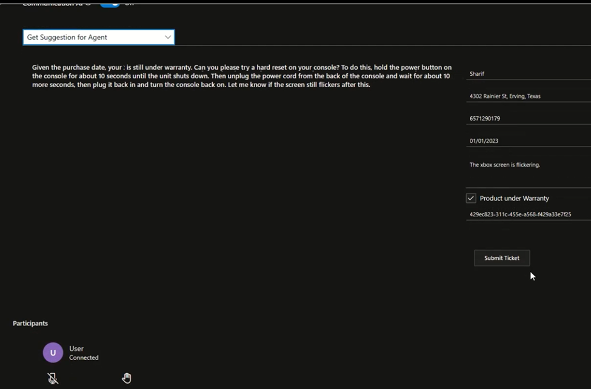
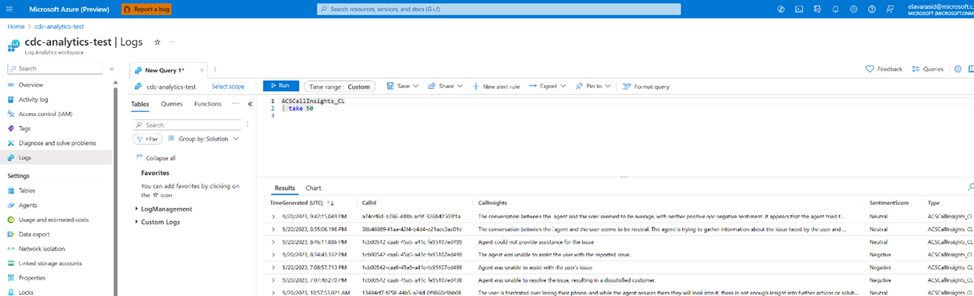
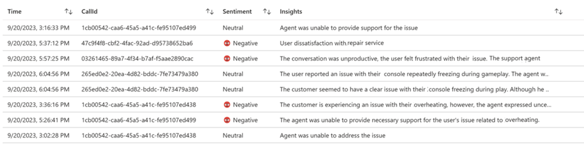
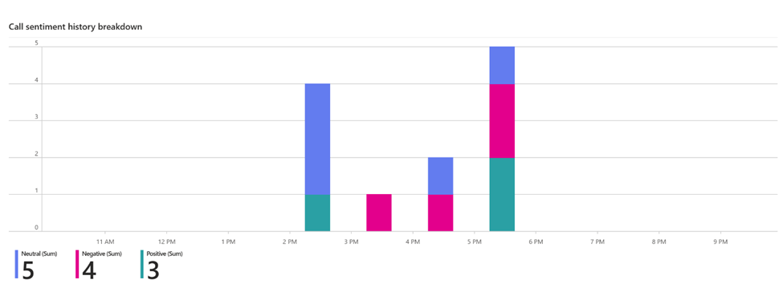

# ACS Client Calling SDK integration with Azure OpenAI

## Reimagining customer support and Business insight
- Azure Communication Services real-time voice and video Client Calling SDK can be used for a wide range of Business To Consumer calling scenarios. 
- In all scenarios, your application will benefit from a wide ecosystem of Azure cloud services.
- This project is an integration of Azure Communication Services Client Calling SDK with Azure Open AI to show how businesses could benefit from artificial intelligence in a client-calling flow. 
- In this Contact Center as a Service model, the contact center support agent receives live recommendations from Open AI on what to say next to best support the customer. 
- Also, call sentiment and call summary that are generated by Open AI can be used by businesses for visualizing call insight. 


# Example scenario:
Imagine a Contoso Live support agent resolving customer issues. In a call, the live support agent must understand customer issues, and come up with troubleshooting suggestions and the agent must also gather customer details and fill in a form to create a support ticket.  
On the other hand, business wants to learn about call insight, such as call sentiment and call summary for business strategy and training purpose. This sample project shows how real-time intelligence can support a live agent and the business with insights:

1.	A Contoso customer calls the Contoso business support agent, who is a team’s identity joining the call through the Contoso application build with Azure Communication Services Client calling SDK.
2.	The Contoso support agent’s client application receives the closed captions of the conversation between the customer and the agent from Azure Communication Services Client Calling SDK.
3.	Azure Communication Services now has a new feature to enable Closed Captions for VoIP calls. Closed Captions are the conversion of a voice or video call audio track into written words that appear in real-time. Right now this feature is Generally Available for calls involving both ACS and Teams’ identity and available in Private Preview for calls involving only ACS identities for both web and native platforms.
4.	The closed captions are sent from the client application to a back-end service built with Azure functions, that is set up to act as a gateway to Azure Open AI. Two prompts are set, one to get Contoso agent suggestions along with customer data gathered from the conversation for form filling and the other one is to gather call sentiment and insights for Business monitoring purposes.
5.	The agent suggestions received from the back end are shown on the Contoso support agent client application user interface. These suggestions give hints to support the agent in solving the customer's issue. The customer information is gathered from the conversation by AI and is used to fill in support ticket creation forms to help the agent with support ticket creation. 
6.	Business insights such as call sentiment (positive/neutral/negative) and call insight summary are sent from the back-end service to Azure monitor, and logs analytics for business visualization

## The call flow is depicted in the diagram below:


## Setup Details:

### Back End:

- Step1: Setup a backend service using Azure function app following the instructions at [Getting started with Azure Functions | Microsoft Learn](https://learn.microsoft.com/en-us/azure/azure-functions/functions-get-started?pivots=programming-language-csharp#create-your-first-function).
- Step2: Create an Azure function “GetSuggestionForContosoSupportAgent”. This function will accept the call transcript between the customer and the support agent. The function connects to Azure OpenAI to fetch suggestions on what the agent should say next to better support the customer based on the conversation transcript so far. In the below code update the Azure Open AI Client creation step with your Azure OpenAI credentials. 

Add ContosoAgenSupportSystemPrompt and ContosoAgentSupportUserPrompt to a constant file:
```csharp
     [FunctionName("GetSuggestionForContosoSupportAgent")]
       public static async Task<IActionResult> HandleGetSuggestionForContosoSupportAgent(
       [HttpTrigger(AuthorizationLevel.Anonymous, "get", "post", Route = null)] HttpRequest req, ILogger log)
       {
           string requestBody = await new StreamReader(req.Body).ReadToEndAsync();
           dynamic data = JsonConvert.DeserializeObject(requestBody);
           String transcript = data?.transcript;

           OpenAIClient client = new OpenAIClient(
                new Uri("<<https://your-azure-openai-resource.com/>>"),
                new AzureKeyCredential("<<your-azure-openai-resource-api-key>>"));


           var chatCompletionsOptions = new ChatCompletionsOptions()
           {
               Messages =
                  {
                       new ChatMessage(ChatRole.System, Constants.ContosoAgentSupportSystemPrompt),
                       new ChatMessage(ChatRole.User, transcript),
                       new ChatMessage(ChatRole.User, Constants.ContosoAgentSupportUserPrompt)
                   },
               Temperature = (float)1,
               MaxTokens = 800            
           };
           Response<ChatCompletions> response = null;
           try
           {
               response = await client.GetChatCompletionsAsync(
               "<<your-deployment-name>>", chatCompletionsOptions);
           } catch(Exception e) 
           {
               Console.WriteLine(e);
           }

           return new OkObjectResult(response.Value.Choices[0].Message.Content);
       }

```

Prompt for GetSuggestionForContosoSupportAgent function:
```csharp
        // Prompt for ContosoAgentSupport
        public static string ContosoAgentSupportUserPrompt = @"From the above conversation between the support agent and the user,
                        Extract user content and fill in the requirements form data
                        If the user-provided content is incomplete, stuttered, or unclear, suggest the support agent with polite suggestions to clarify what was understood and what the agent should ask to fulfill the questions. 
                        The goal is to make sure the user details and issues are well understood and the required details are collected on the form.
                        If the date or mailing address is not valid, suggest agent to get the details from the user.
                        If the purchase date is older than 2 years from the current date, then mark product_under_warranty form data as false.
                        Suggest an agent with troubleshooting suggestions.
                        The response should be a JSON format.
                     
                                {
                                  ""requirements"": {
                                   ""name_provided"": true/fale,
                                    ""mailing_address_provided"": true/false,
                                    ""date_of_purchase_provided"": true/false,
                                    ""phone_number_provided"": true/false,
                                    ""issue_outlined"": true/false
                                  },
                                  ""form_data"": {
                                    ""name"": ""..."",
                                    ""address"": ""..."",
                                    ""phone_number"": ""..."",
                                    ""date_of_purchase"": ""dd/mm/yyyy"",
                                    ""issue_description"": ""..."",
                                   ""product_under_warranty"":"""",
                                   ""issue_resolved_oncall"": """",
                                   ""support_ticket_number"": """"
                                  },
                                  ""suggested_reply"": ""..."",
                                } ";
        public static string ContosoAgentSupportSystemPrompt = "You are an AI assistant assisting a support agent, listening to the conversation between the support agent and the user.";
```

- Step3: Create an Azure function “CallInSights”. This function accepts the callId and entire call transcript between the customer and the support agent. The function fetches call sentiment (positive, negative, neutral) and call summary from Azure OpenAI based on the call transcript. In the below code update the Azure Open AI Client creation step with your Azure OpenAI credentials. Add the sentimentScoreSystemPrompt and sentimentScoreUserPrompt to a constant file.

```csharp
[FunctionName("CallInSights")]
        public async Task<IActionResult> CallInSights(
        [HttpTrigger(AuthorizationLevel.Anonymous, "get", "post", Route = null)] HttpRequest req, ILogger log)
        {
            log.LogInformation("Processing call insights on transcription request");


            string requestBody = await new StreamReader(req.Body).ReadToEndAsync();
            dynamic data = JsonConvert.DeserializeObject(requestBody);
            String transcript = data?.transcript;

            OpenAIClient openAIClient = new OpenAIClient(
                new Uri("<<https://your-azure-openai-resource.com/>>"),
                new AzureKeyCredential("<<your-azure-openai-resource-api-key>>"));

            var chatCompletionsOptions = new ChatCompletionsOptions()
            {
                Messages = 
                   {
                        new ChatMessage(ChatRole.System, Constants.sentimentScoreSystemPrompt),
                        new ChatMessage(ChatRole.User, transcript),
                        new ChatMessage(ChatRole.User, Constants.sentimentScoreUserPrompt),
                    },
                Temperature = (float)1,
                MaxTokens = 800
            };

            Response<ChatCompletions> response = await openAIClient.GetChatCompletionsAsync(
            "<<your-deployment-name>>", chatCompletionsOptions);

            return new OkObjectResult(response.Value.Choices[0].Message.Content);
        }
```


```csharp
// Prompts for call insight generation 
public static string sentimentScoreSystemPrompt = "You are an AI assistant listening to the conversation between the support agent and the user.";
public static string sentimentScoreUserPrompt = @"From the above conversation between the agent and the user,
                Generate a sentiment score Positive, Negative or Neutral, based on the conversation, customer satisfaction, and agent ability to support the user.
                Geneate a call insight. 

                The response should be a JSON format.
                    {
                        ""callSentiment"": """",
                        ""callInsight"": """"
                    }";
```
- Step4: Publish the openaigateway function app [following instructions](https://learn.microsoft.com/en-us/azure/azure-functions/functions-develop-vs?tabs=isolated-process).


## Front End

The Contoso agent User interface is built on top of the Azure Communication Services Web client calling [Sample](https://docs.microsoft.com/en-us/azure/communication-services/samples/web-calling-sample) tutorial. 

- Step1: Follow the instructions on the Azure Calling Services Calling Sample app [GitHub](https://github.com/Azure-Samples/communication-services-web-calling-tutorial) link and set up the web application.

- Step2: Update the web application to include the below changes.
Update CallCaptions.js as below:
- a. Add 3 state variables to represent AI is turned on/off, to represent if the agent is speaking, and to represent if the customer is speaking and if AI functionality is to be turned on off.
    const [communicationAI, setCommunicationAI] = useState(false);
    const [isAgentSpeaking, setIsAgentSpeaking] = useState(false);
    const [isUserSpeaking, setIsUserSpeaking] = useState(false);

- b. Add a toggle button component to turn on AI functionality. When AI functionality is turned on, show the new Communication AI component, that is populated with response from Azure Open AI.
```js
    return (
        <>
            {captions && <SpokenLanguageDropdown />}
            {captions && captions.captionsType === 'TeamsCaptions' && <CaptionLanguageDropdown />}
            <div className="scrollable-captions-container">
                <div id="captionsArea" className="captions-area">
                </div>
            </div>
            <div className="participants-panel mt-1 mb-3">
                <Toggle label= {
                    <div>
                        Communication AI {' '}
                        <TooltipHost content= {`Turn on Communication AI`}>
                            <Icon iconName="Info" aria-label="Info tooltip" />
                        </TooltipHost>
                    </div>
                }
                    styles= {{
                        text: {color: '#edebe9'},
                        label: {color: '#edebe9'},
                    }}
                    inlineLabel
                    onText="On"
                    offText="Off"
                    defaultChecked={communicationAI}
                    onChange= {() => { setCommunicationAI(oldValue => !oldValue)}}
                />
 
                {
                    communicationAI &&
                    <CommunicationAI call={call} isAgentSpeaking={isAgentSpeaking} isUserSpeaking={isUserSpeaking} />
                }
            </div>
        </>
    );
```
     
- c. Create file CommunicationAI.js to handle AI related functionality under src/MakeCall/CommunicationAI.
When the user stops speaking send the captions gathered so far to Azure Open AI. The response received from AI should have the suggestion for the Agent on what to say next to best support the customer and customer data gathered from the conversation to fill in the support form.

```js
import React, { useState, useEffect } from "react";
import { Dropdown } from '@fluentui/react/lib/Dropdown';
import { utils, acsOpenAiPromptsApi } from "./Utils";
import {AgentSupportForm} from "./AgentSupportForm"

const CommunicationAI = ({ call, isAgentSpeaking, isUserSpeaking }) => {
    const [showSpinner, setShowSpinner] = useState(false);

    // Summary
    const [lastSummary, setLastSummary] = useState("");
    const [captionsSummaryIndex, setCaptionsSummaryIndex] = useState(0);

    // Feedback
    const [lastFeedBack, setLastFeedBack] = useState("");
    const [captionsFeedbackIndex, setCaptionsFeedbackIndex] = useState(0);

    // Sentiment
    const [lastSentiment, setLastSentiment] = useState("");
    const [captionsSentimentIndex, setCaptionsSentimentIndex] = useState(0);

    // Support Agent
    const [lastSupportAgentResponse, setLastSupportAgentResponse] = useState("");
    const [setCaptionsSupportAgentResponseIndex] = useState(0);

    const [promptMessage, setPromptMessage] = useState("");

    const [dropDownLabel, setDropDownLabel] = useState("")

    const [agentDebounceCounterRunning, setAgentDebounceCounterRunning] = useState(false);
    const [userDebounceCounterRunning, setUserDebounceCounterRunning] = useState(false);

    const [userName, setUserName] = useState("");
    const [address, setAddress] = useState("");
    const [phoneNumber, setPhoneNumber] = useState("");
    const [dateOfPurchase, setDateOfPurchase] = useState("");
    const [issue, setIssue] = useState("");
    const [productUnderWarranty, setProductUnderWarranty] = useState(false);
    const [issueTicket, setIssueTicket] = useState("");

    const options = [
        { key: 'getSummary', text: 'Get Summary' },
        { key: 'getPersonalFeedBack', text: 'Get Personal Feedback' },
        { key: 'getSentiments', text: 'Get Sentiment Feedback' },
        { key: 'getSuggestionForSupportAgent', text: 'Get Suggestion for Agent' },
    ]
    let agentDebounceTimeoutFn;
    let userDebounceTimeoutFn;
    let displayName = "Agent"

    useEffect(() => {
        call.on('stateChanged', () => {
            if (call.state === 'Disconnected') {
                callInsight(call.id);
            }
        });
    }, []);

    useEffect(() => {
        if (dropDownLabel == "") {
            setShowSpinner(false); 
            return
        }
        clearTimeout(agentDebounceTimeoutFn);
        if (dropDownLabel != "getSuggestionForSupportAgent") {
            if (isAgentSpeaking && !agentDebounceCounterRunning) {
                const message = "FeedBack will be retrieved after you finish talking";
                !showSpinner && setShowSpinner(true);
                setPromptMessage(message);
            } else {
                if (agentDebounceCounterRunning) {
                    agentDebounceTimeoutFn = setTimeout(() => {
                        setAgentDebounceCounterRunning(false);
                    }, 5000);
                } else {
                    dropDownHandler();
                }
            }
        }
        return () => {
            clearTimeout(agentDebounceTimeoutFn);
        }
    }, [isAgentSpeaking, agentDebounceCounterRunning, dropDownLabel]);

    useEffect(() => {
        if (dropDownLabel == "") {
            setShowSpinner(false); 
            return
        }
        clearTimeout(userDebounceTimeoutFn);
        if (isUserSpeaking && dropDownLabel == "getSuggestionForSupportAgent" && !userDebounceCounterRunning) {
            const message = "Support Suggestion will be retrieved after User finishes talking";
            !showSpinner && setShowSpinner(true);
            setPromptMessage(message);
        } else {
            if (userDebounceCounterRunning) {
                userDebounceTimeoutFn = setTimeout(() => {
                    setUserDebounceCounterRunning(false);
                }, 5000);
            } else {
                dropDownHandler();
            }
        }
        return () => {
            clearTimeout(userDebounceTimeoutFn);
        }
    }, [isUserSpeaking, userDebounceCounterRunning, dropDownLabel]);

    const dropDownHandler = async () => {
        dropDownLabel != "" && !showSpinner && setShowSpinner(true)
        setPromptMessage("Waiting for the AI response...");
        switch (dropDownLabel) {
            case "getSummary":
                await getSummary().finally(() => setShowSpinner(false));
                break;
            case "getPersonalFeedBack":
                await getPersonalFeedback().finally(() => setShowSpinner(false));
                break;
            case "getSentiments":
                await getSentiment().finally(() => setShowSpinner(false));
                break;
            case "getSuggestionForSupportAgent":
                await getSuggestionForSupportAgent().finally(() => setShowSpinner(false));
                break;
        }
    }

    const getSummary = async () => {
        try {
            const currentCaptionsData = window.captionHistory.slice(captionsSummaryIndex);
            let response = await utils.sendCaptionsDataToAcsOpenAI(acsOpenAiPromptsApi.summary, displayName, lastSummary, currentCaptionsData);
            let content = response.choices[0].message.content;
            console.log(`getSummary summary ===> ${JSON.stringify(response)}`)
            setLastSummary(content);
            setCaptionsSummaryIndex(window.captionHistory.length);
            displayResponse(content);
        } catch (error) {
            console.error(JSON.stringify(error))
        }
    }

    const getPersonalFeedback = async () => {
        try {
            const currentCaptionsData = window.captionHistory.slice(captionsFeedbackIndex);
            let response = await utils.sendCaptionsDataToAcsOpenAI(acsOpenAiPromptsApi.feedback, displayName, lastFeedBack, currentCaptionsData)
            let content = response.choices[0].message.content;
            console.log(`getPersonalFeedback ===> ${JSON.stringify(response)}`)
            setLastFeedBack(content);
            setCaptionsFeedbackIndex(window.captionHistory.length);
            displayResponse(content);
        } catch(error) {
            console.error(JSON.stringify(error))
        }
    }

    const getSentiment = async () => {
        try {
            const currentCaptionsData = window.captionHistory.slice(captionsSentimentIndex);
            let response = await utils.sendCaptionsDataToAcsOpenAI(acsOpenAiPromptsApi.sentiment, displayName, lastSentiment, currentCaptionsData)
            let content = response.emotions && response.emotions.join(", ")
            let callToAction = response.call_to_action;
            if (!content || !content.length) {
                content = "Neutral" //default is no senitment is detected
            }
            if (callToAction) {
                content += "\nRecommended Action:\n"
                content += callToAction;
            } 
            console.log(`getSentimentt ===> ${JSON.stringify(response)}`)
            setLastSentiment(content);
            setCaptionsSentimentIndex(window.captionHistory.length);
            displayResponse(content);
        } catch(error) {
            console.error(JSON.stringify(error))
        }
    }

    const getSuggestionForSupportAgent = async () => {
        try {
            let response = await utils.sendCaptionsDataToAcsOpenAI(acsOpenAiPromptsApi.supportAgent, 
                    displayName, lastSupportAgentResponse, window.captionHistory, true)
            let content = response.suggested_reply;
            console.log(`getSuggestionForSupportAgent ===> ${JSON.stringify(response)}`)
            console.log(`form_data ===> ${JSON.stringify(response.form_data)}`)
            retrieveFormData(response.form_data)
            setLastSupportAgentResponse(content);
            setCaptionsSupportAgentResponseIndex(window.captionHistory.length);
            displayResponse(content);
        } catch(error) {
            console.error(JSON.stringify(error))
        }
    }

    const callInsight = async (callId) => {
        await utils.sendCaptionsDataToAcsOpenAI(acsOpenAiPromptsApi.callInsights, displayName, '', window.captionHistory, true, callId);
    }

    const retrieveFormData = (form_data) => {
        if (form_data.name && form_data.name != 'N/A' && form_data.name != userName) {
            setUserName(form_data.name)
        }

        if (form_data.address && form_data.address != 'N/A' && form_data.address != address) {
            setAddress(form_data.address)
        }

        if (form_data.phone_number && form_data.phone_number != 'N/A' && form_data.phone_number != phoneNumber) {
            setPhoneNumber(form_data.phone_number)
        }

        if (form_data.date_of_purchase && form_data.date_of_purchase != 'N/A' && form_data.date_of_purchase != dateOfPurchase) {
            setDateOfPurchase(form_data.date_of_purchase)
        }

        if (form_data.issue_description && form_data.issue_description != 'N/A' && form_data.issue_description != issue) {
            setIssue(form_data.issue_description)
        }

        if (form_data.product_under_warranty && form_data.product_under_warranty != 'N/A' && form_data.product_under_warranty != productUnderWarranty) {
            setProductUnderWarranty(form_data.product_under_warranty)
        }

        if (form_data.support_ticket_number && form_data.support_ticket_number != 'N/A' && form_data.support_ticket_number != issueTicket) {
            setIssueTicket(form_data.support_ticket_number)
        }
    }

    const onChangeHandler = (e, item) => {
        setDropDownLabel(item.key);
    }

    const displayResponse = (responseText) => {
        let captionAreasContainer = document.getElementById(dropDownLabel);

        if(!responseText || !responseText.length) {return;}

        if (dropDownLabel == "getSuggestionForSupportAgent" || dropDownLabel == "getSentiments") {
            captionAreasContainer.style['font-size'] = '13px';
            captionAreasContainer.innerText  = responseText;
        } else {
            let aiResponseContent = document.createElement('div');
            aiResponseContent.style['borderBottom'] = '1px solid';
            aiResponseContent.style['padding'] = '10px';
            aiResponseContent.style['whiteSpace'] = 'pre-line';
            aiResponseContent.style['color'] = 'white';
            aiResponseContent.style['font-size'] = '12px';
            aiResponseContent.textContent = responseText;
            captionAreasContainer.appendChild(aiResponseContent);
        }
    }

    return (
        <>
            <div id="" className="">
                {
                    showSpinner &&
                    <div>
                        <div className="loader inline-block"> </div>
                        <div className="ml-2 inline-block">
                            {
                                promptMessage
                            }
                        </div>
                    </div>
                }
                <Dropdown
                    placeholder="Select an option"
                    label={dropDownLabel}
                    options={options}
                    styles={{ dropdown: { width: 300 }, }}
                    onChange={onChangeHandler}
                />
            </div>

            <div id="communicationResponse">
                {
                    dropDownLabel == "getSummary" && 
                    <div className="scrollable-captions-container">
                        <div id="getSummary" className="ai-captions-area">
                        </div>
                    </div>
                }

                {
                    dropDownLabel == "getSentimentt" && 
                    <div className="scrollable-captions-container">
                        <div id="getSentimentt" className="ai-captions-area">
                        </div>
                    </div>
                }

                {
                    dropDownLabel == "getPersonalFeedback" && 
                    <div className="scrollable-captions-container">
                        <div id="getPersonalFeedback" className="ai-captions-area">
                        </div>
                    </div>
                }

                {
                    dropDownLabel == "getSuggestionForSupportAgent" && 
                    <div className="card">
                        <div className="ms-Grid">
                            <div className="ms-Grid-row">
                                <div className="scrollable-captions-container ms-Grid-col ms-Grid-col ms-sm6 ms-md6 ms-lg6">
                                    <div id="getSuggestionForSupportAgent" className="captions-area">
                                        {lastSupportAgentResponse}
                                    </div>
                                </div>
                                {lastSupportAgentResponse && <AgentSupportForm 
                                    name = {userName}
                                    address = {address}
                                    phoneNumber = {phoneNumber}
                                    dateOfPurchase = {dateOfPurchase}
                                    issue = {issue}
                                    productUnderWarranty = {productUnderWarranty} 
                                    issueTicket = {issueTicket}
                                />}
                            </div>
                        </div>
                    </div>
                }
            </div>
        </>
    );
};

export default CommunicationAI;
```


- d. Create a file Utils.js under src/MakeCall/CommunicationAI for the sendCaptionsDataToAcsOpenAI function that sends the captions data and received intelligence from Open AI.

```js
import axios from 'axios';
export const acsOpenAiPromptsApi = {
    base: 'https://fhlopenaicalling.azurewebsites.net/api/',
    summary: 'getSummary',
    feedback: 'getPersonalFeedback',
    sentiment: 'GetSentiments',
    supportAgent: 'getSuggestionForSupportAgent',
    callInsights: 'CallInsights',
    getBriefSummary: 'GetBriefSummary'
}

export const utils = {
    sendCaptionsDataToAcsOpenAI: async (apiEndpoint, participantName, lastResponse, newCaptionsData, isTranscriptType = false, callId ="") => {
        let response = await axios({
            url: acsOpenAiPromptsApi.base + apiEndpoint,
            method: 'POST',
            headers: {
                'Content-Type': 'application/json',
                'Access-Control-Allow-Origin': "*",
                'X-Requested-With': 'XMLHttpRequest',
            },
            data: (isTranscriptType || apiEndpoint === acsOpenAiPromptsApi.callInsights) ?
                {
                    "transcript": newCaptionsData.join(' '),
                    "callId": callId
                } :
                {
                    "CurrentParticipant": participantName,
                    "Captions": JSON.stringify(newCaptionsData),
                    "LastSummary": JSON.stringify(lastResponse),
                }
        });
        if (response.status === 200) {
            return response.data;
        } else {
            console.log("Error message");
            console.log(response);
        }
    }
};
```

- e. The CommunicationAI UI component would be filled with the response from AI. It would show a suggestion for the Agent to best support the customer and an AgentSupportForm component that is filled with the customer data that AI gathered from the conversation. The AgentSupportForm.js needs to be created as below under src/MakeCall/CommunicationAI.

```js
import React, { useEffect, useState } from "react";
import {
    TextField, PrimaryButton, Checkbox, MessageBar,
    MessageBarType,
} from 'office-ui-fabric-react'
import { v4 as uuidv4 } from 'uuid';

export const AgentSupportForm = ({name, address, phoneNumber, dateOfPurchase, issue, productUnderWarranty}) => {
    const [userFullName, setUserFullName] = useState("");
    const [userAddress, setUserAddress] = useState("");
    const [userPhoneNumber, setUserPhoneNumber] = useState("");
    const [userDateOfPurchase, setUserDateOfPurchase] = useState("");
    const [IssueDescription, setIssueDescription] = useState("");
    const [underWarranty, setUnderWarranty] = useState(false);
    const [issueTicket, setIssueTicket] = useState("");
    const [isSubmitted, setIsSubmitted] = useState(false)

    useEffect(()=> {
        if (name !=  userFullName) {setUserFullName(name)}
        if (address !=  userAddress) {setUserAddress(address)}
        if (phoneNumber !=  userPhoneNumber) {setUserPhoneNumber(phoneNumber)}
        if (dateOfPurchase !=  userDateOfPurchase) {setUserDateOfPurchase(dateOfPurchase)}
        if (issue !=  IssueDescription) {setIssueDescription(issue)}
        if (productUnderWarranty !=  underWarranty) {setUnderWarranty(productUnderWarranty)}

        if (userFullName && userAddress && userPhoneNumber && userDateOfPurchase && IssueDescription) {
            console.log(`CHUK_TICKET === Updating Ticket number`);
            setIssueTicket(uuidv4())
        } else {
            console.log(`CHUK_TICKET === NOT Updating Ticket number`);
        }
    }, [name, address, phoneNumber, dateOfPurchase, issue, productUnderWarranty])

    const handleSubmit = (e) => {
        e.preventDefault();
        setIsSubmitted(true)
        setUserFullName("");
        setUserAddress("")
        setUserPhoneNumber("")
        setUserDateOfPurchase("")
        setIssueDescription("")
        setUnderWarranty(false)
        setIssueTicket("")
        setTimeout(() => {
            setIsSubmitted(false)
        }, 5000)
    }

    const FormSubmitted = () => {
        return (<MessageBar
          messageBarType={MessageBarType.success}
          isMultiline={false}
        >
          Ticket created successfully
        </MessageBar>)
    };

    return <>
        <div className="ms-Grid-col ms-Grid-col ms-sm6 ms-md6 ms-lg6" >
            {isSubmitted && FormSubmitted()}
            <div className="ms-Grid-row">
                <div className="ms-Grid-row">
                    <TextField
                        placeholder="FullName"
                        value={userFullName}
                        className="text-left"
                        onChange={(e) => { setUserFullName(e.target.value)}} 
                    />
                </div>
                <div className="ms-Grid-row">
                    <TextField
                        placeholder="Address"
                        value={userAddress}
                        className="text-left"
                        onChange={(e) => { setUserAddress(e.target.value)}} 
                    />
                </div>
                <div className="ms-Grid-row">
                    <TextField
                        placeholder="PhoneNumber" 
                        value={userPhoneNumber}
                        className="text-left"
                        onChange={(e) => { setUserPhoneNumber(e.target.value)}}  />
                </div>
                <div className="ms-Grid-row">
                    <TextField
                        placeholder="Date of Purchase" 
                        value={userDateOfPurchase}
                        className="text-left"
                        onChange={(e) => { setUserDateOfPurchase(e.target.value)}}  />
                </div>
                <div className="ms-Grid-row">
                    <TextField
                        placeholder="Issue Description" 
                        multiline rows={5}
                        value={IssueDescription}
                        className="text-left"
                        onChange={(e) => { setIssueDescription(e.target.value)}}  />
                </div>
                <div className="ms-Grid-row">
                    <Checkbox label="Product under Warranty"  checked={underWarranty} onChange={(e, checked) => {setUnderWarranty(checked)}} />
                </div>

                <div className="ms-Grid-row">
                    <TextField
                        placeholder="Issue Ticket#"
                        value={issueTicket}
                        className="text-left"
                        onChange={(e) => { setIssueTicket(e.target.value)}}
                    />
                </div>
            </div>
            <div className="ms-Grid-row">
                <div className="ms-Grid-col">
                    <PrimaryButton className="primary-button mt-5 text-left"

                        onClick={(e) => {handleSubmit(e)}}>
                            Submit Ticket
                    </PrimaryButton>
                </div>
            </div>
        </div>
    </>
}
```


## Functioning
 When the agent is in the call, on the user interface, turn on closed captions. Turn on the AI flag and choose Get Support for Agent from the drop down. The application starts sending out closed captions of the conversation gathered so far between the customer and the agent to the back end GetSuggestionForSupportAgent service end point, every time there is the user stops speaking. Artificial intelligence aided agent suggestions and AI extracted customer data received from the API end point are shown on the UI as below.

The below image shows the updated User interface of the test application that shows the AgentSupportForm filled with the customer data gathered and send by OpenAI, and the agent suggestion box, that provides suggestions for the agent to best support the customer with trouble shooting the issue:



The application also sends out accumulated closed captions of the entire conversation between the agent and the customer just before the call ends, to the backend service CallInSights API end point, where artificial intelligence aided call insights such as call sentiment (positive/negative/neutral) and call summary gets generated. This insight can be sent out to log analytics for logging and Azure monitor for Business visualization. To log insights and generate visualization follow Azure.Monitor.Ingestion Namespace - [Azure for .NET Developers | Microsoft Learn](https://learn.microsoft.com/en-us/dotnet/api/azure.monitor.ingestion?view=azure-dotnet) & [Azure Monitor overview - Azure Monitor | Microsoft Learn](https://learn.microsoft.com/en-us/azure/azure-monitor/overview)

- Log analytics – call insights:


Azure monitor visualization for Business:



This entire sample code can be found at:
Front end: [communication-services-web-calling-tutorial at calling_AIBased_AgentSupport](link)
Back end: [openAIGateway](link)

## Summary:
Azure Communications Services client calling + Open AI can revolutionize the way businesses interact with its customers. AI integration can generate insightful visualization that business can leverage to make informed business decisions.


