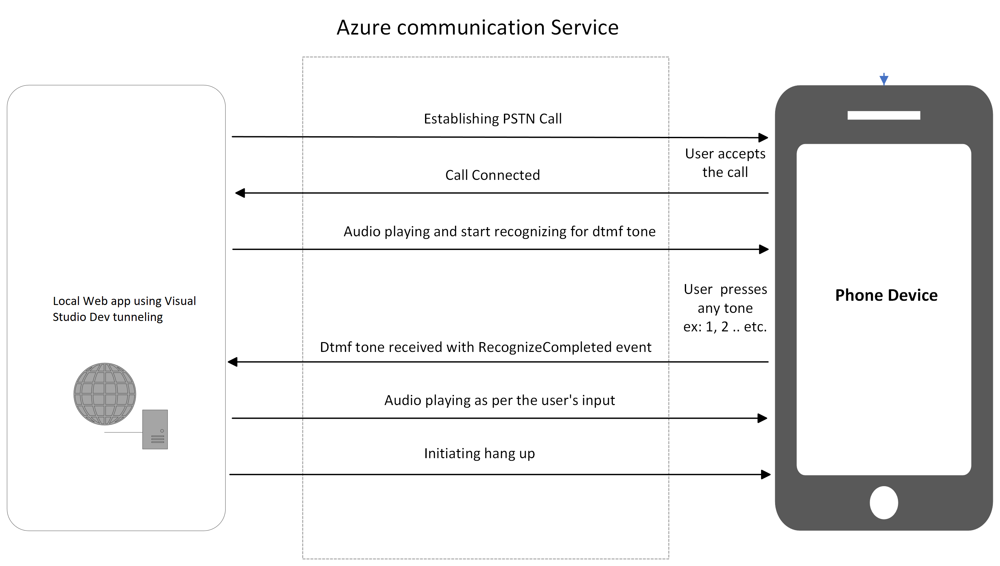
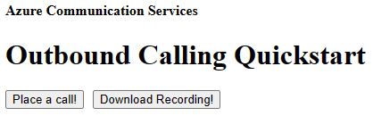

|page_type|languages|products
|---|---|---|
|sample|<table><tr><td>Typescript</tr></td></table>|<table><tr><td>azure</td><td>azure-communication-services</td></tr></table>|

# Call Automation - Quick Start Sample

This sample application shows how the Azure Communication Services  - Call Automation SDK can be used to build IVR related solutions. 
It makes an outbound call to a phone number, performs DTMF recognition, plays a different audio message based on the key pressed by the callee and hangs-up the call. 
This sample application configured for accepting tone 1 (tone1), 2 (tone2) , If the callee pressed any other key than expected, the call will be disconnected.
This sample application is also capable of making multiple concurrent outbound calls. The application is a web-based application built on Express.js framework.

# Design



## Prerequisites

- Create an Azure account with an active subscription. For details, see [Create an account for free](https://azure.microsoft.com/free/)
- [Visual Studio Code](https://code.visualstudio.com/download) installed
- [Node.js](https://nodejs.org/en/download) installed
- Create an Azure Communication Services resource. For details, see [Create an Azure Communication Resource](https://docs.microsoft.com/azure/communication-services/quickstarts/create-communication-resource). You will need to record your resource **connection string** for this sample.
- Get a phone number for your new Azure Communication Services resource. For details, see [Get a phone number](https://learn.microsoft.com/en-us/azure/communication-services/quickstarts/telephony/get-phone-number?tabs=windows&pivots=programming-language-csharp)


## Before running the sample for the first time

1. Open an instance of PowerShell, Windows Terminal, Command Prompt or equivalent and navigate to the directory that you would like to clone the sample to.
2. git clone `https://github.com/Azure-Samples/communication-services-javascript-quickstarts.git`.
3. cd into the `CallAutomation_OutboundCalling` folder.
4. From the root of the above folder, and with node installed, run `npm install`

### Setup and host your Azure DevTunnel

[Azure DevTunnels](https://learn.microsoft.com/en-us/azure/developer/dev-tunnels/get-started?tabs=windows) is an Azure service that enables you to share local web services hosted on the internet. Use the commands below to connect your local development environment to the public internet. This creates a tunnel with a persistent endpoint URL and which allows anonymous access. We will then use this endpoint to notify your application of calling events from the ACS Call Automation service.

```bash
devtunnel create --allow-anonymous
devtunnel port create -p 8080
devtunnel host
```

### Configuring application

Open the `.env` file to configure the following settings

1. `CONNECTION_STRING`: Azure Communication Service resource's connection string.
2. `ACS_RESOURCE_PHONE_NUMBER`: Phone number associated with the Azure Communication Service resource. For e.g. "+1425XXXAAAA"
3. `TARGET_PHONE_NUMBER`: Target phone number to add in the call. For e.g. "+1425XXXAAAA"
4. `CALLBACK_URI`: Base url of the app. (For local development replace the dev tunnel url)
5. `MEDIA_CALLBACK_URI`: Url where audio file is served.

### Run app locally

1. Open a new Powershell window, cd into the `CallAutomation_OutboundCalling` folder and run `npm run dev`
2. Browser should pop up with the below page. If not navigate it to `http://localhost:8080/`
3. To initiate the call, click on the `Place a call!` button or make a Http get request to https://<CALLBACK_URI>/call
4. To downaload the call audio, click on the `Download Recording!` button or make a Http get request to https://<CALLBACK_URI>/download. Ensure the call has ended before attempting to download

