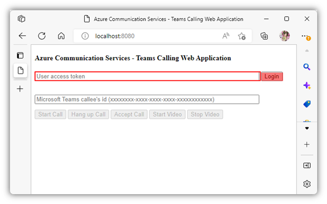

# Build your first Teams calling application

This tutorial demonstrates step-by-step instructions to build a video calling web application empowered by [Azure Communication Service](https://azure.microsoft.com/en-us/products/communication-services/#overview). This application connects you to a Microsoft Teams user as shown in the picture. The dark window on the right is using Microsoft Teams whereas the bright window on the left is the application we will build. The tutorial has a prerequisites section that prepares you for further development. After the prerequisites section, we will prepare you for web development environment; give you sample code to build and run; and teach you how to use the application.


## Table of Contents
- [Prerequisites](#prerequisites)
- [Setup development environment](#setup-development-environment)
- [Develop the code](#develop-the-code)
- [Run the code](#run-the-code)
- [Use the application](#use-the-application)
- [Ask questions]


## Prerequisites
- Create [Microsoft Azure account](https://azure.microsoft.com/free/?WT.mc_id=A261C142F) with active subscription
- Install [Node.js](https://nodejs.org/en/)
- Add [Azure Communication Service resrouce](https://learn.microsoft.com/en-us/azure/communication-services/quickstarts/create-communication-resource?pivots=platform-azp&tabs=windows#create-azure-communication-services-resource) to your Azure subscription
- Create [User Access Token](https://learn.microsoft.com/en-us/azure/communication-services/quickstarts/manage-teams-identity?pivots=programming-language-javascript#step-3-exchange-the-azure-ad-access-token-of-the-teams-user-for-a-communication-identity-access-token)
- Obtain a Teams id using [Graph Explorer](https://developer.microsoft.com/en-us/graph/graph-explorer)

## Setup Development Environment
1. Open terminal and run the following command to create a folder for your Teams calling application.

```
mkdir myTeamsCallingApp && cd myTeamsCallingApp
```


2. Install packages with the following commands.

```
npm install @azure/communication-common --save
npm install @azure/communication-calling@1.8.1-beta.1 --save
```

3. Install webpack with the following command.

```
npm install webpack@4.42.0 webpack-cli@3.3.11 webpack-dev-server@3.10.3 --save-dev
```

## Develop the code

1. Navigate to your application folder and create an `index.html` file.


2. Open your `index.html` file with your favorite editor and paste the code below.
```html
<!-- index.html -->
<!DOCTYPE html>
<html>
    <head>
        <title>Azure Communication Services - Teams Calling Web Application</title>
    </head>
    <body>
        <h4>Azure Communication Services - Teams Calling Web Application</h4>
        <input id="user-access-token"
            type="text"
            placeholder="User access token"
            style="margin-bottom:1em; width: 500px;"/>
        <button id="initialize-teams-call-agent" type="button">Login</button>
        <br>
        <br>
        <input id="callee-teams-user-id"
            type="text"
            placeholder="Microsoft Teams callee's id (xxxxxxxx-xxxx-xxxx-xxxx-xxxxxxxxxxxx)"
            style="margin-bottom:1em; width: 500px; display: block;"/>
        <button id="start-call-button" type="button" disabled="true">Start Call</button>
        <button id="hangup-call-button" type="button" disabled="true">Hang up Call</button>
        <button id="accept-call-button" type="button" disabled="true">Accept Call</button>
        <button id="start-video-button" type="button" disabled="true">Start Video</button>
        <button id="stop-video-button" type="button" disabled="true">Stop Video</button>
        <br>
        <br>
        <div id="connectedLabel" style="color: #13bb13;" hidden>Call is connected!</div>
        <br>
        <div id="remoteVideoContainer" style="width: 40%;" hidden>Remote participants' video streams:</div>
        <br>
        <div id="localVideoContainer" style="width: 30%;" hidden>Local video stream:</div>
        <!-- points to the bundle generated from client.js -->
        <script src="./bundle.js"></script>
    </body>
</html>
```

3. Go to your application folder and create a `client.js` file


4. Open your `client.js` file with your favorite editor and paste the code below.
```js
// Make sure to install the necessary dependencies
const { CallClient, VideoStreamRenderer, LocalVideoStream } = require('@azure/communication-calling');
const { AzureCommunicationTokenCredential } = require('@azure/communication-common');
const { AzureLogger, setLogLevel } = require("@azure/logger");
// Set the log level and output
setLogLevel('verbose');
AzureLogger.log = (...args) => {
    console.log(...args);
};
// Calling web sdk objects
let teamsCallAgent;
let deviceManager;
let call;
let incomingCall;
let localVideoStream;
let localVideoStreamRenderer;
// UI widgets
let userAccessToken = document.getElementById('user-access-token');
let calleeTeamsUserId = document.getElementById('callee-teams-user-id');
let initializeCallAgentButton = document.getElementById('initialize-teams-call-agent');
let startCallButton = document.getElementById('start-call-button');
let hangUpCallButton = document.getElementById('hangup-call-button');
let acceptCallButton = document.getElementById('accept-call-button');
let startVideoButton = document.getElementById('start-video-button');
let stopVideoButton = document.getElementById('stop-video-button');
let connectedLabel = document.getElementById('connectedLabel');
let remoteVideoContainer = document.getElementById('remoteVideoContainer');
let localVideoContainer = document.getElementById('localVideoContainer');
/**
 * Create an instance of CallClient. Initialize a TeamsCallAgent instance with a CommunicationUserCredential via created CallClient. TeamsCallAgent enables us to make outgoing calls and receive incoming calls. 
 * You can then use the CallClient.getDeviceManager() API instance to get the DeviceManager.
 */
initializeCallAgentButton.onclick = async () => {
    try {
        const callClient = new CallClient(); 
        tokenCredential = new AzureCommunicationTokenCredential(userAccessToken.value.trim());
        teamsCallAgent = await callClient.createTeamsCallAgent(tokenCredential)
        // Set up a camera device to use.
        deviceManager = await callClient.getDeviceManager();
        await deviceManager.askDevicePermission({ video: true });
        await deviceManager.askDevicePermission({ audio: true });
        // Listen for an incoming call to accept.
        teamsCallAgent.on('incomingCall', async (args) => {
            try {
                incomingCall = args.incomingCall;
                acceptCallButton.disabled = false;
                startCallButton.disabled = true;
            } catch (error) {
                console.error(error);
            }
        });
        startCallButton.disabled = false;
        initializeCallAgentButton.disabled = true;
    } catch(error) {
        console.error(error);
    }
}
/**
 * Place a 1:1 outgoing video call to a user
 * Add an event listener to initiate a call when the `startCallButton` is selected.
 * Enumerate local cameras using the deviceManager `getCameraList` API.
 * In this quickstart, we're using the first camera in the collection. Once the desired camera is selected, a
 * LocalVideoStream instance will be constructed and passed within `videoOptions` as an item within the
 * localVideoStream array to the call method. When the call connects, your application will be sending a video stream to the other participant. 
 */
startCallButton.onclick = async () => {
    try {
        const localVideoStream = await createLocalVideoStream();
        const videoOptions = localVideoStream ? { localVideoStreams: [localVideoStream] } : undefined;
        call = teamsCallAgent.startCall([{ microsoftTeamsUserId: calleeTeamsUserId.value.trim() }], { videoOptions: videoOptions });
        // Subscribe to the call's properties and events.
        subscribeToCall(call);
    } catch (error) {
        console.error(error);
    }
}
/**
 * Accepting an incoming call with a video
 * Add an event listener to accept a call when the `acceptCallButton` is selected.
 * You can accept incoming calls after subscribing to the `TeamsCallAgent.on('incomingCall')` event.
 * You can pass the local video stream to accept the call with the following code.
 */
acceptCallButton.onclick = async () => {
    try {
        const localVideoStream = await createLocalVideoStream();
        const videoOptions = localVideoStream ? { localVideoStreams: [localVideoStream] } : undefined;
        call = await incomingCall.accept({ videoOptions });
        // Subscribe to the call's properties and events.
        subscribeToCall(call);
    } catch (error) {
        console.error(error);
    }
}
// Subscribe to a call obj.
// Listen for property changes and collection udpates.
subscribeToCall = (call) => {
    try {
        // Inspect the initial call.id value.
        console.log(`Call Id: ${call.id}`);
        //Subsribe to call's 'idChanged' event for value changes.
        call.on('idChanged', () => {
            console.log(`Call ID changed: ${call.id}`); 
        });
        // Inspect the initial call.state value.
        console.log(`Call state: ${call.state}`);
        // Subscribe to call's 'stateChanged' event for value changes.
        call.on('stateChanged', async () => {
            console.log(`Call state changed: ${call.state}`);
            if(call.state === 'Connected') {
                connectedLabel.hidden = false;
                acceptCallButton.disabled = true;
                startCallButton.disabled = true;
                hangUpCallButton.disabled = false;
                startVideoButton.disabled = false;
                stopVideoButton.disabled = false;
            } else if (call.state === 'Disconnected') {
                connectedLabel.hidden = true;
                startCallButton.disabled = false;
                hangUpCallButton.disabled = true;
                startVideoButton.disabled = true;
                stopVideoButton.disabled = true;
                console.log(`Call ended, call end reason={code=${call.callEndReason.code}, subCode=${call.callEndReason.subCode}}`);
            }   
        });
        call.localVideoStreams.forEach(async (lvs) => {
            localVideoStream = lvs;
            await displayLocalVideoStream();
        });
        call.on('localVideoStreamsUpdated', e => {
            e.added.forEach(async (lvs) => {
                localVideoStream = lvs;
                await displayLocalVideoStream();
            });
            e.removed.forEach(lvs => {
               removeLocalVideoStream();
            });
        });
        
        // Inspect the call's current remote participants and subscribe to them.
        call.remoteParticipants.forEach(remoteParticipant => {
            subscribeToRemoteParticipant(remoteParticipant);
        });
        // Subscribe to the call's 'remoteParticipantsUpdated' event to be
        // notified when new participants are added to the call or removed from the call.
        call.on('remoteParticipantsUpdated', e => {
            // Subscribe to new remote participants that are added to the call.
            e.added.forEach(remoteParticipant => {
                subscribeToRemoteParticipant(remoteParticipant)
            });
            // Unsubscribe from participants that are removed from the call
            e.removed.forEach(remoteParticipant => {
                console.log('Remote participant removed from the call.');
            });
        });
    } catch (error) {
        console.error(error);
    }
}
// Subscribe to a remote participant obj.
// Listen for property changes and collection udpates.
subscribeToRemoteParticipant = (remoteParticipant) => {
    try {
        // Inspect the initial remoteParticipant.state value.
        console.log(`Remote participant state: ${remoteParticipant.state}`);
        // Subscribe to remoteParticipant's 'stateChanged' event for value changes.
        remoteParticipant.on('stateChanged', () => {
            console.log(`Remote participant state changed: ${remoteParticipant.state}`);
        });
        // Inspect the remoteParticipants's current videoStreams and subscribe to them.
        remoteParticipant.videoStreams.forEach(remoteVideoStream => {
            subscribeToRemoteVideoStream(remoteVideoStream)
        });
        // Subscribe to the remoteParticipant's 'videoStreamsUpdated' event to be
        // notified when the remoteParticiapant adds new videoStreams and removes video streams.
        remoteParticipant.on('videoStreamsUpdated', e => {
            // Subscribe to newly added remote participant's video streams.
            e.added.forEach(remoteVideoStream => {
                subscribeToRemoteVideoStream(remoteVideoStream)
            });
            // Unsubscribe from newly removed remote participants' video streams.
            e.removed.forEach(remoteVideoStream => {
                console.log('Remote participant video stream was removed.');
            })
        });
    } catch (error) {
        console.error(error);
    }
}
/**
 * Subscribe to a remote participant's remote video stream obj.
 * You have to subscribe to the 'isAvailableChanged' event to render the remoteVideoStream. If the 'isAvailable' property
 * changes to 'true' a remote participant is sending a stream. Whenever the availability of a remote stream changes
 * you can choose to destroy the whole 'Renderer' a specific 'RendererView' or keep them. Displaying RendererView without a video stream will result in a blank video frame. 
 */
subscribeToRemoteVideoStream = async (remoteVideoStream) => {
    // Create a video stream renderer for the remote video stream.
    let videoStreamRenderer = new VideoStreamRenderer(remoteVideoStream);
    let view;
    const renderVideo = async () => {
        try {
            // Create a renderer view for the remote video stream.
            view = await videoStreamRenderer.createView();
            // Attach the renderer view to the UI.
            remoteVideoContainer.hidden = false;
            remoteVideoContainer.appendChild(view.target);
        } catch (e) {
            console.warn(`Failed to createView, reason=${e.message}, code=${e.code}`);
        }	
    }
    
    remoteVideoStream.on('isAvailableChanged', async () => {
        // Participant has switched video on.
        if (remoteVideoStream.isAvailable) {
            await renderVideo();
        // Participant has switched video off.
        } else {
            if (view) {
                view.dispose();
                view = undefined;
            }
        }
    });
    // Participant has video on initially.
    if (remoteVideoStream.isAvailable) {
        await renderVideo();
    }
}
// Start your local video stream.
// This will send your local video stream to remote participants so they can view it.
startVideoButton.onclick = async () => {
    try {
        const localVideoStream = await createLocalVideoStream();
        await call.startVideo(localVideoStream);
    } catch (error) {
        console.error(error);
    }
}
// Stop your local video stream.
// This will stop your local video stream from being sent to remote participants.
stopVideoButton.onclick = async () => {
    try {
        await call.stopVideo(localVideoStream);
    } catch (error) {
        console.error(error);
    }
}
/**
 * To render a LocalVideoStream, you need to create a new instance of VideoStreamRenderer, and then
 * create a new VideoStreamRendererView instance using the asynchronous createView() method.
 * You may then attach view.target to any UI element. 
 */
// Create a local video stream for your camera device
createLocalVideoStream = async () => {
    const camera = (await deviceManager.getCameras())[0];
    if (camera) {
        return new LocalVideoStream(camera);
    } else {
        console.error(`No camera device found on the system`);
    }
}
// Display your local video stream preview in your UI
displayLocalVideoStream = async () => {
    try {
        localVideoStreamRenderer = new VideoStreamRenderer(localVideoStream);
        const view = await localVideoStreamRenderer.createView();
        localVideoContainer.hidden = false;
        localVideoContainer.appendChild(view.target);
    } catch (error) {
        console.error(error);
    } 
}
// Remove your local video stream preview from your UI
removeLocalVideoStream = async() => {
    try {
        localVideoStreamRenderer.dispose();
        localVideoContainer.hidden = true;
    } catch (error) {
        console.error(error);
    } 
}
// End the current call
hangUpCallButton.addEventListener("click", async () => {
    // end the current call
    await call.hangUp();
});
```

## Run the code
1. Build and run your code with the following command in terminal.
```
npx webpack-dev-server --entry ./client.js --output bundle.js --debug --devtool inline-source-map
```

2. Go to http://localhost:8080/ from your browser to access the application.


## Use the application
1. Enter the User access token you acquired from **Prerequisites**, and click login


2. Enter a Teams id you acquired from “Prerequisites” as your callee, and click Start Call
 

### **Congratulations! You just set up your first Teams calling application!**


## Ask questions
You can post your questions via our [support channels](https://learn.microsoft.com/en-us/azure/communication-services/support). 
