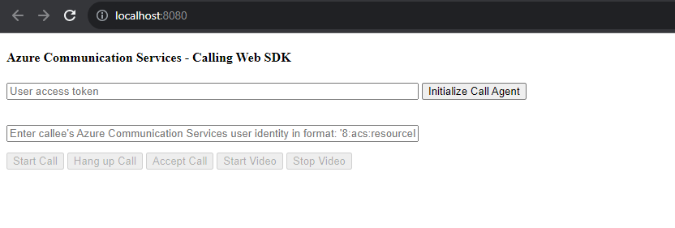

# Add 1 on 1 video calling to your application

This code sample walks through the process of integration Azure Communication Services video calling into your JavaScript application.

This quickstart sample includes the code that is explained as part of [this document](https://docs.microsoft.com/azure/communication-services/quickstarts/voice-video-calling/get-started-with-video-calling). See that document for additional details on how this sample works.

## Prerequisites
- Obtain an Azure account with an active subscription. [Create an account for free](https://azure.microsoft.com/free/?WT.mc_id=A261C142F).
- You need to have [Node.js 18](https://nodejs.org/dist/v18.18.0/). You can use the msi installer to install it.
- Create an active Communication Services resource. [Create a Communication Services resource](https://docs.microsoft.com/azure/communication-services/quickstarts/create-communication-resource).
- Create a User Access Token to instantiate the call client. [Learn how to create and manage user access tokens](https://docs.microsoft.com/azure/communication-services/quickstarts/access-tokens?pivots=programming-language-javascript).

## Run the code
1. Run `npm i` on the directory of the project to install dependencies
2. Use the webpack serve command to build and run the app on a local server:
`npx webpack serve --config webpack.config.js`
3. Once the local server starts up, open your browser and navigate to http://localhost:8080/. You'll see the calling application:

To make an 1:1 outgoing video call, first provide user access token to initiate the call agent, then provide a ACS user ID in the text field and clicking the Start Call button. When the callee answers the call with video, call will be connected and you will see each other's videos.
