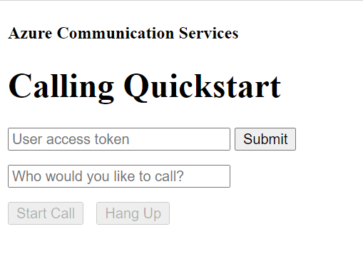

# Add 1 on 1 voice calling to your application

This code sample walks through the process of integration Azure Communication Services voice calling into your Javascript application.

This quickstart sample includes the code that is explained as part of [this document](https://docs.microsoft.com/azure/communication-services/quickstarts/voice-video-calling/getting-started-with-calling?pivots=platform-web). See that document for additional details on how this sample works.

## Prerequisites
- An Azure account with an active subscription. [Create an account for free](https://azure.microsoft.com/free/?WT.mc_id=A261C142F).
- [Node.js](https://nodejs.org/en/) Active LTS and Maintenance LTS versions (8.11.1 and 10.14.1)
- An active Communication Services resource. [Create a Communication Services resource](https://docs.microsoft.com/azure/communication-services/quickstarts/create-communication-resource).
- A User Access Token to instantiate the call client. [Learn how to create and manage user access tokens](https://docs.microsoft.com/azure/communication-services/quickstarts/access-tokens?pivots=programming-language-javascript).

## Run the code
1. Run `npm i` on the directory of the project to install dependencies
2. Use the webpack-dev-server to build and run your app. Run the following command to bundle application host in on a local webserver:

        npx webpack-dev-server --entry ./client.js --output bundle.js --debug --devtool inline-source-map

Open your browser and navigate to http://localhost:8080/. You should see the following:

You can make an 1:1 outgoing voice call by providing a user ID in the text field and clicking the Start Call button. 
