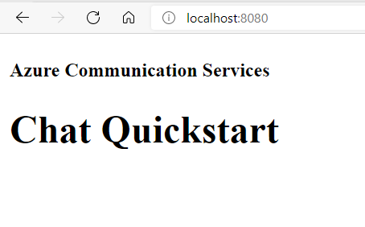

# Add chat to your application

This code sample walks through the process of integration Azure Communication Services real time chat into your Javascript application.

This quickstart sample includes the code that is explained as part of [this document](https://docs.microsoft.com/en-us/azure/communication-services/quickstarts/chat/get-started?pivots=programming-language-javascript). See that document for additional details on how this sample works.

## Prerequisites
- An Azure account with an active subscription. [Create an account for free](https://azure.microsoft.com/en-us/free/?WT.mc_id=A261C142F).
- [Node.js](https://nodejs.org/en/) Active LTS and Maintenance LTS versions (8.11.1 and 10.14.1)
- An active Communication Services resource. [Create a Communication Services resource](https://docs.microsoft.com/en-us/azure/communication-services/quickstarts/create-communication-resource?tabs=windows&pivots=platform-azp).
- A User Access Token to instantiate the call client. [Learn how to create and manage user access tokens](https://docs.microsoft.com/en-us/azure/communication-services/quickstarts/access-tokens?pivots=programming-language-javascript).
- Create three ACS Users and issue them a user access token [User Access Token](https://docs.microsoft.com/en-us/azure/communication-services/quickstarts/access-tokens?pivots=programming-language-javascript). Be sure to set the scope to chat, and note the token string as well as the userId string. The full demo creates a thread with two initial participants and then adds a third participant to the thread.

## Run the code
npm run start

Open your browser and navigate to http://localhost:8080/. You should see the following:

In the developer tools console within your browser you should see following:

Azure Communication Chat client created!

