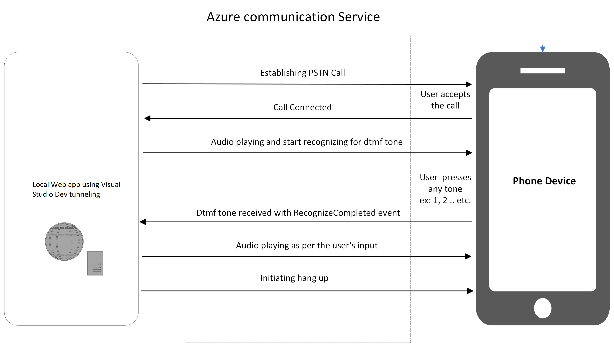

|page_type|languages|products
|---|---|---|
|sample|<table><tr><td>javascript</tr></td></table>|<table><tr><td>azure</td><td>azure-communication-services</td></tr></table>|

# Call Automation - Appointment Reminder Sample

This sample application shows how the Azure Communication Services  - Call Automation SDK can be used to build IVR related solutions. This sample makes an outbound call to a phone number or communication user identifier performs dtmf recognition and the application plays next audio based on the key pressed by the callee. This sample application configured for accepting tone 1 (tone1), 2 (tone2) , If the callee pressed any other key than expected, an invalid audio tone will be played and then call will be disconnected.
This sample application is also capable of making multiple concurrent outbound calls.The application is a console based application build using Node.js.
# Design

## Prerequisites

- Create an Azure account with an active subscription. For details, see [Create an account for free](https://azure.microsoft.com/free/)
- [Visual Studio code](https://code.visualstudio.com/)
- [Node.js](https://nodejs.org/en/) 14.17.3 and above
- Install the [Typescript Compiler](https://code.visualstudio.com/Docs/languages/typescript#_installing-the-typescript-compiler)
- Create an Azure Communication Services resource. For details, see [Create an Azure Communication Resource](https://docs.microsoft.com/azure/communication-services/quickstarts/create-communication-resource). You'll need to record your resource **connection string** for this sample.
- Get a phone number for your new Azure Communication Services resource. For details, see [Get a phone number](https://docs.microsoft.com/azure/communication-services/quickstarts/telephony-sms/get-phone-number?pivots=platform-azp)
- Download and install [Ngrok](https://www.ngrok.com/download). As the sample is run locally, Ngrok will enable the receiving of all the events.
- Generate Ngrok Url by using below steps
	- Open command prompt or powershell window on the machine using to run the sample.
	- Navigate to directory path where Ngrok.exe file is located. Then, run:
		- ngrok http {portNumber} (For e.g. ngrok http 8080)
	- Get Ngrok Url generated. Ngrok Url will be in the form of e.g.  "https://95b6-43-230-212-228.ngrok-free.app"

### Prerequisite check
- In a terminal or command window, run `node --version` to check that Node.js is installed.

## Before running the sample for the first time

1. Open an instance of PowerShell, Windows Terminal, Command Prompt or equivalent and navigate to the directory that you would like to clone the sample to.
2. git clone `https://github.com/moirf/communication-services-javascript-quickstarts`.
3. Navigate to `call-automation-appointment-reminder` folder.

### Configuring application

- Open the config.js file to configure the following settings

	- ConnectionString: Azure Communication Service resource's connection string.
	- SourcePhoneNumber: Phone number associated with the Azure Communication Service resource.For e.g. "+1425XXXAAAA"
	- TargetIdentifier: Target phone number or communication user identifier to add in the call. For e.g. "+1425XXXAAAA" or "8:acs:e333a5b5-c1e4-4984-b752-447bf92d10b7_00000018-5d49-93c5-f883-084822004dc5" (Communication user identifier can be generated from the url :https://acs-sample-app.azurewebsites.net/)
	- AppBaseUri: Base url of the app. (For local devlopment replace the Ngrok url.For e.g. "https://95b6-43-230-212-228.ngrok-free.app")

### Run the Application

- Navigate to the directory containing the package.json file and use the following commands for installing all the dependencies:
	- npm install
- To run the sample, first run:
	- tsc .\server.ts
- This will generate server.js file, then run:
	- node .\server.js or npm run start
- Trigger API call using postman
	- http Get Request url: {AppBaseUri}/api/call