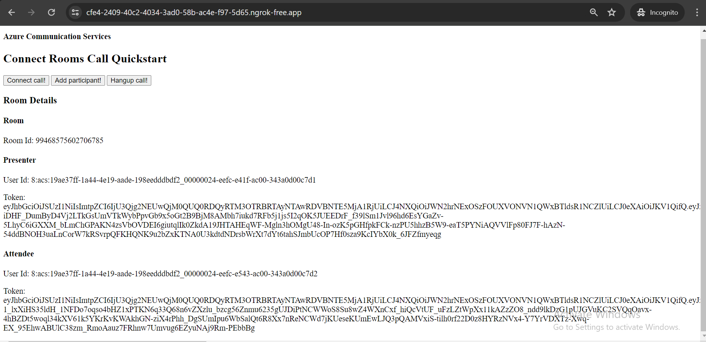
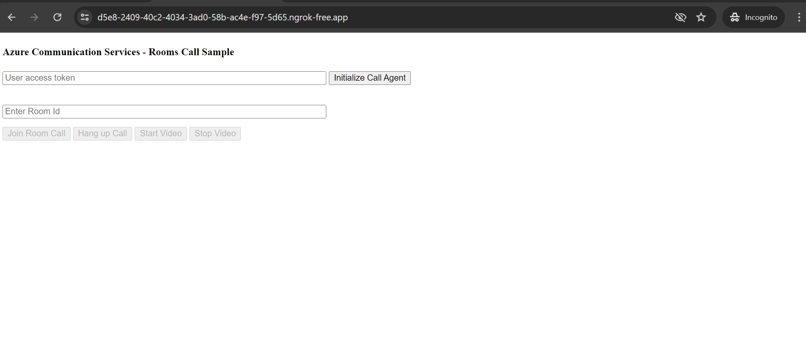
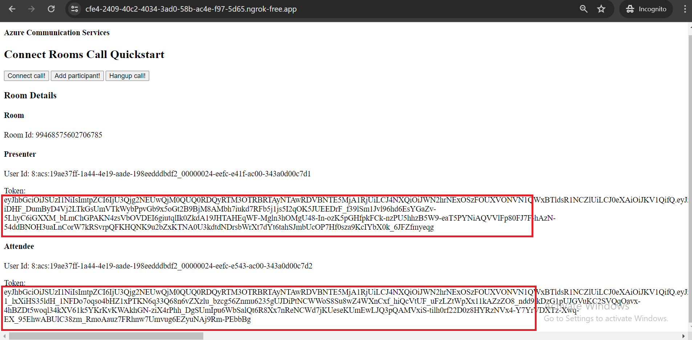
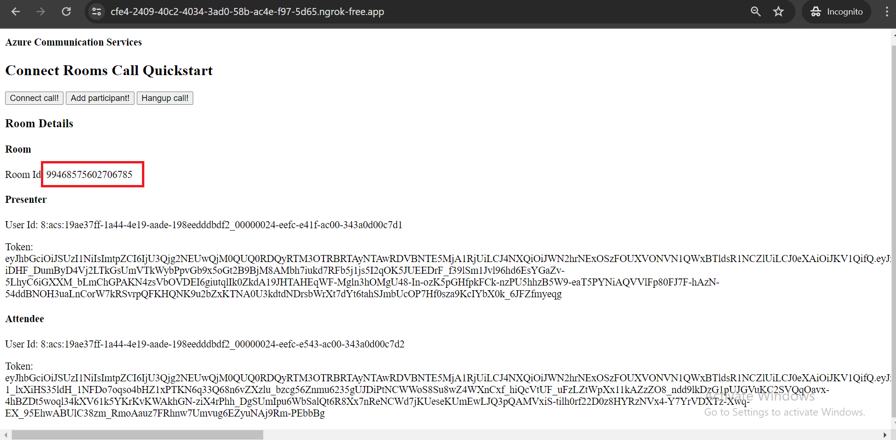
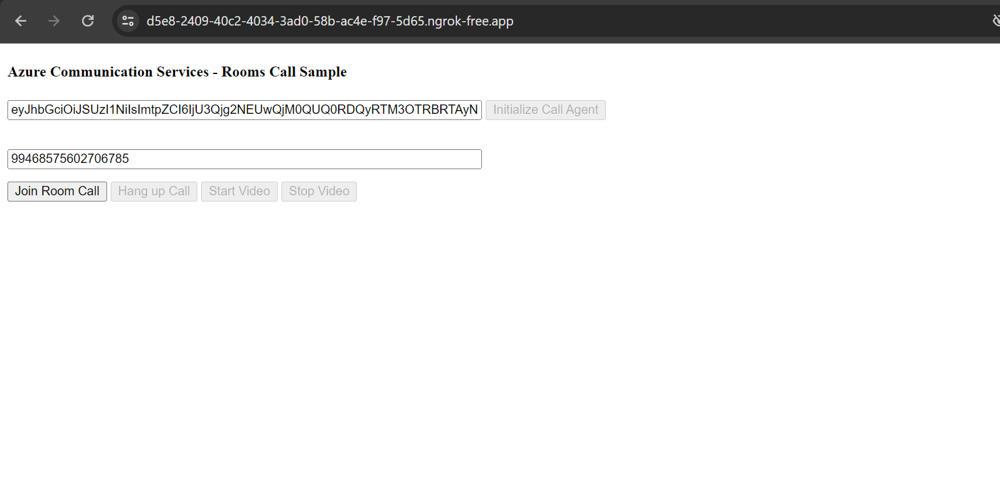
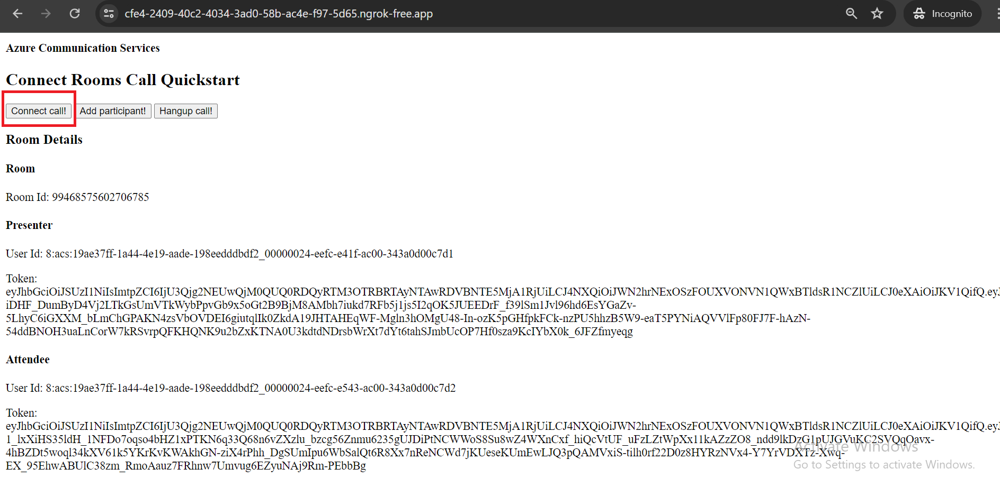

|page_type|languages|products
|---|---|---|
|sample|<table><tr><td>Typescript</tr></td></table>|<table><tr><td>azure</td><td>azure-communication-services</td></tr></table>|

# Call Automation - Quick Start Sample

In this quickstart, we cover how you can use Call Automation SDK to connect to active room call with connect endpoint. Creating room with users and enabling pstn dialout to add pstn participant.
Creating room call with room id.

## Prerequisites

- Create an Azure account with an active subscription. For details, see [Create an account for free](https://azure.microsoft.com/free/)
- [Visual Studio Code](https://code.visualstudio.com/download) installed
- [Node.js](https://nodejs.org/en/download) installed
- Create an Azure Communication Services resource. For details, see [Create an Azure Communication Resource](https://docs.microsoft.com/azure/communication-services/quickstarts/create-communication-resource). You will need to record your resource **connection string** for this sample.
- Get a phone number for your new Azure Communication Services resource. For details, see [Get a phone number](https://learn.microsoft.com/azure/communication-services/quickstarts/telephony/get-phone-number?tabs=windows&pivots=programming-language-csharp)

- To know about rooms see https://learn.microsoft.com/en-us/azure/communication-services/concepts/rooms/room-concept
- To join room call see https://learn.microsoft.com/en-us/azure/communication-services/quickstarts/rooms/join-rooms-call?pivots=platform-web

## Before running the sample for the first time

1. Open an instance of PowerShell, Windows Terminal, Command Prompt or equivalent and navigate to the directory that you would like to clone the sample to.
2. git clone `https://github.com/Azure-Samples/communication-services-javascript-quickstarts.git`.
3. cd into the `callautomation-connect-rooms-quickstart` folder.
4. From the root of the above folder, and with node installed, run `npm install`

## Before running calling rooms quickstart
1. To initiate rooms call with room id https://github.com/Azure-Samples/communication-services-javascript-quickstarts/tree/main/calling-rooms-quickstart
2. cd into the `calling-rooms-quickstart` folder.
3. From the root of the above folder, and with node installed, run `npm install`
4. to run sample `npx webpack serve --config webpack.config.js`

### Setup and host your Azure DevTunnel

[Azure DevTunnels](https://learn.microsoft.com/en-us/azure/developer/dev-tunnels/get-started?tabs=windows) is an Azure service that enables you to share local web services hosted on the internet. Use the commands below to connect your local development environment to the public internet. This creates a tunnel with a persistent endpoint URL and which allows anonymous access. We will then use this endpoint to notify your application of calling events from the ACS Call Automation service.

```bash
devtunnel create --allow-anonymous
devtunnel port create -p 8080
devtunnel host
```

### Configuring application

Open the `.env` file to configure the following settings

1. `CONNECTION_STRING`: Azure Communication Service resource's connection string.
2. `ACS_RESOURCE_PHONE_NUMBER`: Phone number associated with the Azure Communication Service resource. For e.g. "+1425XXXAAAA"
3. `TARGET_PHONE_NUMBER`: Target phone number to add in the call. For e.g. "+1425XXXAAAA"
4. `CALLBACK_URI`: Base url of the app. (For local development replace the dev tunnel url)

### Run app locally

1. Open a new Powershell window, cd into the `callautomation-connect-rooms-quickstart` folder and run `npm run dev`
2. Browser should pop up with the below page. If not navigate it to `http://localhost:8080/`
3. To connect rooms call, click on the `Connect a call!` button or make a Http get request to https://<CALLBACK_URI>/connectCall

### Creating and connecting to room call.

1. 
2. Open two tabs for Presenter and attendee   
3. Copy tokens for presenter and attendee from 
4. Initialize call agent with tokens for both presenter and attendee.
5. Take room id  and initiate rooms call for both users. 
6. Connect room call with callautomation connect call endpoint. 


