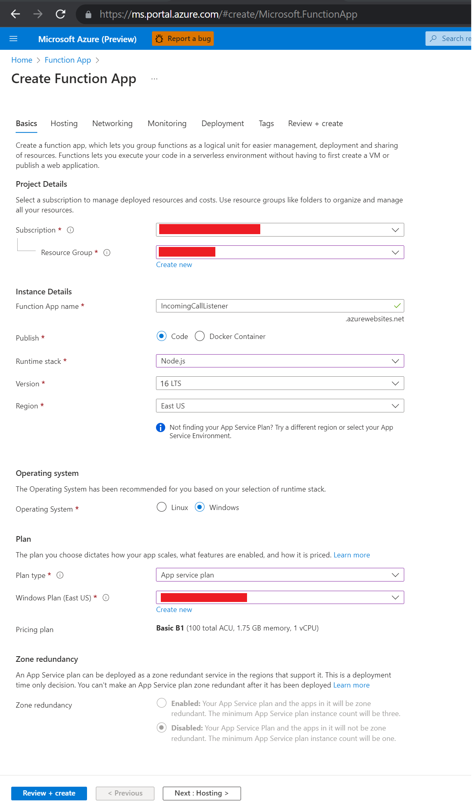

# ACS Web Calling SDK - Web push notifications architecture quickstart

This quickstart will showcase how to set up a web push notification architecture for the ACS Web Calling SDK. We will walk through the set up steps necessary to set up the architecture. For this architecture, we will be sending the web push notifications via OneSignal, a trusted web push service provider (You can also use this tutorial as a guidance if you want to use your own web push notification provider).

- Prerequisites:
    - Must use ACS Web Calling SDK version 1.12.0-beta.2+ (@azure/communication-calling in npmjs.org)
    - Clone this repo into your local machine for development/set up of this architecture.
    - An Azure Communication Services subscription and resource.
    - A OneSignal account. You can create one at OneSignal.com

Main components of this web push notification architecture are:
- Back-end:
    - OneSignal service app - You will use OneSignal to easily send web push notifications to callees.
    - IncomingCallListener Function App - You will create this Azure Function App to listen to ACS IncomingCall events from ACS EventGrid, and call your OneSignal app via REST to send the Incoming Call web push notification to the callee who will accept/decline the incoming call.
    - `webpack.config.js` - Backend server for this application. From this server you will generate ACS CommunicationUserTokens for front end client apps to log into(create CallAgent objects) the ACS Web Calling SDK. We will also generate OneSignal Registration Tokens to map them to ACS CommunicationUserTokens. We will keep this mapping here on our backend server.
- Front-end:
    - `./src` - Contains files for the front end application to demo web push notifications. This front-end application will use the ACS Web Calling SDK for web calling functionality. The fron end will also register its device to our OneSignal app so that it can receive web push notifications!

### Create your OneSignal service app
OneSignal is one of many web push providers. It is a tool that you can use to send push notifications to your web clients so that they will see the native browser notification window pop up with information about the notification. Create your account at OneSignal.com
- Once you create your account, navigate to your Apps dashboard and click on "New App/Website" to create your OneSignal service app:

  
  
- Give your OneSignal app a name, select "Web", then click on "Next: Configure Your Platform" button:

  
  
- You will now be at the "Web Configuration" page:
    - For "1. Choose Integration". select "Custom Code".
    - For "SITE NAME", it can be anything you want.
    - For "SITE URL", you must use the exact url origin of where you will be deploying this quickstart application to, for example something like "https://webpushnotificationsquickstart.azurewebsites.net". We will show you how to deploy to azure app service later. Web push notifications only work in trusted https protocol hence you will have to run this quickstart application in https. <i>For this quickstart we'll refer to "https://webpushnotificationsquickstart.azurewebsites.net" as the origin url where we'll deploy this application to later on. Obviously we wouldnt be able to use this URL if someone else in the world is already using it and youll use your own URL that you want to use.</i>
      > **Note**
      > You must use the exact url origin of where you will be deploying this quickstart application to
    - Click the "Save" button to create your OneSignal service app.

  
  
- You will then see your OneSignal app's settings. Take note of the `appId` and `safari_web_id`. We will use these later in the front-end and back-end. Click on the "Finish" button:

  
  
- Navigate to your "Settings" -> "Keys & IDs" menu, take note of you `Rest API Key` because we will use it later in our backend. You can also get your `app Id` from this menu:
> **Warning**
> <b><i>Keep this key safe in the backend only, do not share with anyone and do not send it to your client apps</i></b>

### Create your IncomingCall event listener Function App
We will set up an azure function app to subscribe to our ACS EventGrid IncomingCall event and then call OneSignal's "Create Notification" REST API to send the Incoming Call web push notification to the callee. In our function app will also keep a static mapping of our OneSignalRegistrationTokens to ACS communicationUserIds. For the purposes of this quickstart demo and easier explanation, we will create our function app to handle this logic.
> **Note**
> <b><i>It is best to use an Azure Function App for this logic so we can call OneSignal directly from Azure so that the callee can receive the web push notification as fast as possible. Do not do this logic from a backend server.</i></b>
- From the Azure portal, search for "function app" and click on the "+" button to create a new Function App. Or go to "Function App" services and click on "+ Create" button:
 
  
  
- Basics options
    - Choose your ACS subscription.
    - Choose your ACS resoruce group. This is the resource that we will be subscribing to for IncomingCall events. When a user in this ACS resource makes an outgoing call or adds a participant to a call, an IncomingCall event will be emitted to our function app.
    - Give your Function App a name. Give it any name you want. <i>For this quickstart, we'll use the name "IncomingCallListener" to refer to our Function App. Obviously we wouldnt be able to use this name if someone else in the world is already using it and youll use your own name that you want to use.</i>
    - For "Runtime stack" and "Version", make sure to choose NodeJS version 16LTS or 18LTS.
      > **Note**
      > Make sure you choose NodeJS for this because we are using Javascript in our Function App.
    - Choose the region where you want this function app to be deployed.
    - <b><i>For plan type, choose "App Service plan" and choose your plan. Make sure the plan is at least Basic B1. It is necessary to have this for the purpose of this quickstart because we will be setting our function app to always be on for long running testing purposes. If your function app is not running continuously, then its static OneSignalRegistrationToken to commnunicationUserId mapping will get reset every 20 minutes, and users will have to get a new one signal registration token. Hence we will set our function to always be on so that our mapping doesnt reset for testing purposes. We'll set this setting in a later step below once our function app is created.</i></b>

- Hosting options
    - Choose your azure storage account.
  
- Click on "Review + create" button to crete our function app. Youll be redirected to a page that will show you that your function app deployment is in progress. Wait for it it finish, it should take less than a minute. Once its completed, you can click on "Go to resource" to navigate to the function app's dashboard. The dashboard will look like so:

  
  
- Navigate to Settings Configuration menu from the left side panel, then "General settings" tab, and set "Always on" option to "On". <b><i>It is necessary to set this option to "On" this for the purpose of this quickstart so that we can do long running testing. If your function app is not running continuously, then its static OneSignalRegistrationToken to commnunicationUserId mapping will get reset every 20 minutes, and users will have to get a new one signal registration token. Hence we will set our function to always be on so that our mapping doesnt reset for testing purposes.</i></b>:

  
- From our calling-web-push-notifications folder in Visual Sutdio Code. Open the `./IncomingCallListener_FunctionApp/HandleIncomingCallEvent/index.js` file:
    - Replace \<Your OneSignal REST API Key\> with your OneSignal Rest API key. Use "Basic " before the key as shown in the screenshot below.
      > **Warning** 
      > <b><i>Do not ever expose this REST API key anywhere to the public. Do not check it into public repos, do not send it to your client apps. This is your OneSignal REST API key and should be kept secured in a back-end service at all times.</i></b>
    - Replace \<Your OneSignal app Id\> with your OneSignal app Id.
    - If you dont have and dont remember your OneSignal rest api key and OneSignal app id, you can get both of these from your OneSignal app's dashboard in the "Settings" -> "Keys & IDs". We generated these on the ealier steps when we created our OneSignal app.
    - Replace \<Your website's URL\> with the URL origin where you will be deploying this quickstart's front-end client and webpack.config server. The url must start with "https://". For the purposes of this quickstart demo, we are using "https://webpushnotificationsquickstart.azurewebsites.net", obviously this url doesnt belong to you, so you will enter your own, same one you specified in your OneSignal app's settings from the beginning of this quickstart. This woul be the URL where you would be deploying this quickstart application.
    - Save your changes to this `./IncomingCallListener_FunctionApp/HandleIncomingCallEvent/index.js` file.
    
  
- From Visual Studio Code, right click on the IncomingCallListener_FunctionApp folder, then click on "Reveal in File Explorer" to open it up in the File Explorer.:

  
- From your file explorer window that just opened up, go inside the IncomingCallListener_FunctionApp folder, select all 4 items and compress them into a zip file:

  
- The .zip file will be creted, you can name it "IncomingCallListener_FunctionApp.<b>zip</b>":

  
- We will drag and drop this IncomingCallListener_FunctionApp.zip file into the Kudu "Zip Push Desploy UI" in a later step, so keep this File Explorer window opened for now.
  
- Go to your "IncomingCallListener" function app dashboard in the Azure portal, from the left side panel under "Development tools", open "Advanced Tools". The click on "Go ->":

  
- A new tab will open with the Kudu tool. Go to the "Tools" -> "Zip Push Deploy" menu:
 
- Then from your File Explorer that we left oepned from earlier step, drag and drop the "IncomingCallListener_FunctionApp.zip" into the Kudu "Zip Push Deploy" UI. It will load for few seconds, just wait, and then the /wwwroot folder structure should look like this:
 
- The structure of the IncomingCallListener Function App is like so:
    - /HandleIncomingCallEvent (sub function)
        - function.json - config file.
        - index.js - This is the logic that will listen for the IncomingCall event from ACS EventGrid, and will then call OneSignal's "Create Notification" Rest API to deliver the Incoming Call web push notification to the callee. It will use the callee's OneSignalRegistrationToken to signal the callee's devices. We are storing the OneSignalRegistrationTokens for our users in /Shared/OneSignalRegistrationTokens.js
    - /setOneSignalRegistrationTokenForUser (sub function)
        - function.json - config file.
        - index.js - This is a REST api end point to receive OneSignalRegistrationTokens for our users. Our application server in webpack.config.js of this project, will generate the OneSignalRegistrationToken for a communicationUserId and send it here to this rest api end point which we will then store it in our mapping which is in /Shared/OneSignalRegistrationTokens.js
    - /Shared/OneSignalRegistrationTokens.js - Contains the static mapping of OneSignalRegistrationTokens to communicationUserIds. <b><i>Make sure your function app is set to "Always on" during testing purposes of this quickstart or this mapping will be reset every 20 minutes. You can set this option in "Settings Configuration" menu of the function app, then "General settings" tab. We have also explained above with a screenshot of where to set this option.</i></b>
    - > **Warning**
      > <b><i>Important: The reason to use randomly generated OneSignal registration tokens for our communication users, is for security purposes. Do not use communication user ids to identify the end user devices for signaling. You must use randomly generated OneSignalRegistrationTokens to signal the end users. Each end user will only know about their own OneSignalRegistrationToken. Users will not know about other users' OneSignalRegistrationTokens. These tokens will be generated in our webpack.config server when creating user tokens.</i></b>
  
  
- From the Azure portal, go to the HandleIncomingCallEvent sub function function under your "Functions" menu. If you dont see it yet, just wait a couple minutes or fresh the page until you see it. It will show up soon enough:

  
- Go to the integration menu:

  
- Under the “Trigger” box, click on “Event Grid Trigger”, then click on “Create Event Grid subscription”:

- The "Create Event Subscription" window will open and fill it out as shown below:
    - Give it any name youd like
    - For Topic Types choose “Azure Communication Services”
    - For subscription, select your Azure Communication Services subscription
    - Select your ACS resource group and your ACS resource under that group. It must be the one for the same ACS connection string that you will use to generate CommunicationUserTokens. Note resource is under a certaion resource group, they are two different things.
    - For “Filter to Event Types”, choose “Incoming Call”.
    - Then click create button and wait for it to be create, it will only take a few seconds and youll see the notification on the top right side of the azure portal once it is successfully finished creating.

### Set up webpack.config.js backend web server
- Open the `./serverConfig.json` file and fill in the required fields:
    - "connectionString" - This is your Azure Communication Services resource (not resource group) connecting string which will be used for generating ACS CommunicationUserTokens. You can find this connection string by going to your ACS resource (not resource group) in the azure portal and navigating to the "Settings" -> "Keys" menu:
    
    - "functionAppOneSignalTokenRegistrationUrl" - The format of this url is "https://\<Your function app name\>.azurewebsites.net/api/setOneSignalRegistrationTokenForUser?code=\<api key\>". You can find this url in your setOneSignalRegistrationTokenForUser sub function. Click on the "Get funtion Url" button and copy and paste it into the functionAppOneSignalTokenRegistrationUrl key in the serverConfig.json file:
    
    - Enter the values for "connectionString" and "functionAppOneSignalTokenRegistrationUrl" in `./serverConfig` file:
    
- Open the `./webpack.config.js` file:
    - Ensure the code line for port is like so: `const port = process.env.port || 8080;`
    - Ensure `devServer` includes these options: `contentBase:'./public'` and `allowedHosts:['.azurewebsites.net']`
    - If your going to deploy the client app and webpack server app to somewhere else other than ".azurewebsites.net", you may have to adjust this setting. More on how to deploy to azure app serive in a later step.

### Set up client side fron-end app config
- Open the clientConfig.json file and fill in the required fields:
    - "oneSignalAppId" - Your OneSignal app id which you created earlier.
    - "oneSignalSafariWebId": Your OneSignal safari web id which you created earlier.
    - You can find both of these ids in you OneSignal dashboard under "Settings" -> "Keys & IDs" menu or you also noted them down from ealier during this step:
    
- Ensure the OneSignalSDKUpdaterWorker.js and OneSignalSDKWorker.js files are in the ./public folder.
    - Ensure they both have just this one line of code: `importScripts('https://cdn.onesignal.com/sdks/OneSignalSDKWorker.js');`
    - <b><i>These files must be placed in the `./public` folder, and your webpack.config.js `devServer` must have the option `contentBase:'./public'`. This is because both of these OneSignal sdk files must be served from the base url of our web server</i></b>
- Ensure this line is commented out in ./src/index.js: `// serviceWorker.unregister();`

### Deploying the client web app and web server to Azure App Service (azurewebsites.net)
<b><i>Note: This section shows how to deploy this application to Azure App Service (azurewebsites.net). If you want to deploy to a different deployment environment other than Azure App Service, then the following steps dont apply to you and you may need to change the ./webpack.config.js and ./package.json configurations according to your deployment environment specifications.</i></b>

- This web app has been setup to be easily deployed to Azure App Service
    - ./webpack.config.js.
        - `allowedHosts`: Specifies that it allows this app to be hosted in "https://\<appname\>.azurewebsites.net" which is how Azure App Service hosts web apps.
        - `contentBase`: The folder where public assets can be served from. For example, a request to your app like GET https://\<appname\>.azurewebsites.org/OneSignalSDKUpdaterWorker.js, will serve the OneSignalSDKUpdaterWorker.js file  that resides in the contentBase folder. This app has this field set to the './public' folder. <b>Do not change this.</b>
        - `const port = process.env.port || 8080;` When deployed to prod, server will use port 8080. <b>Do not change this. This is the port used by azure app service by default</b>
    - ./package.json
        - "start-local" script. This will start the server on local machine at port 5000.
        - "build-local" script. This will build the the application in development mode
        - "start" script. Used by Azure App Service when deploying. This will start server in port 8080. Port 8080 is specified in webpack.config.js. Do not change this port when deploying to Azrue App Service becaue this is the port that Azure App Service uses.
        - "build" script. Used by Azure App Service when deploying to build the application.

- Navigate to "App Services" in your Azrue portal and create a new app service:

- Fill in the required details:
    - For Subscription and Resrouce Group, use the same as for the ones used when you created the Function App earlier.
    - For name, use the url where you will be deploying this web app. For the purpose of this quickstart demo, we are showing "https://webpushnotificationsquickstart.azurewebsites.net". You will use your own URL which would be the same exact URL that you had used for "SITE URL" option when we created the OneSignal app from erlier.
    - For "Publish", choose "Code".
    - For "Runtime stack" choose "Node 16 LTS"
    - Choose you plan.
    
- Click on "Create" button then click on "Review + create" button. The app service will start to be created. After about less than a minute, it will be created and you can click on the "Go to resource" button to navigate to the app service dashboard.
- You can go ahead and click on the "Start" button if it is not started already to start the app service:

- If the service starts successfully, you'll see a start success notification on the upper right hand side of Azure portal:

- Install the "Azure tools" and "Azure App Service" extensions for Visual Studio Code if you have not done so already:

- Once installed, click on the Azure icon on the left side panel, and then click on "Sign in to Azure..." to log in with you same Azure account that you use for Azure Communication Services. This should be the same account that you use to provision you Azure Communication Service resource. This account should also be the acount that you had logged into the Azure portal for when we created the Azure App Service and even also the "IncomingCallListener" Function App from earlier.
- Once logged in, you should see your subscriptions. Under your subscription and under "App services", you'll find your app service you just created, in our case "webpushnotificationsquickstart". Right click on it, and select "Deploy to Web App...":

- On the top of the Visual Studio Code window, youll be prompted to choose a folder, select the "calling-web-push-notifications" folder, or browse to it and select it if you dont see it listed:

- If prompted to override deployment, select "Deploy":

- Youll see a small notification window on the bottom right side of the Visual Studio code window. Click on the blue "output window":

- The Visual Studio Code output window will open up and you can see the current deployment status. Once deplyoment finishes successfully, youll see a final "Deployment to \<app name\> completed" message at the end of the output:

- Navigate to the app URL, in our case https://webpushnotificationsquickstart.azurewebsites.net. If you dont see the app or see errors, try restarting and redeploying the app service.

### Using the client app to test our web push notifications architecture
- Now that the calling web app has been deployed. Navigate to iton a browser.
- Youll be prompted to subscribe to notifications. Click on allow:

  
- After allowing, make sure the bell at the bottom right of the screen turns blurry. A blurry bell means your successfully subscribe to receive web push notifications. If it doesnt turn blurry automatically, then just click on it to subscribe:

  
- And if you hover your mouse over the bell, it will show a pop up that says "Your're subscribed to notifications":

### Troubleshooting
- Browsers supported for web push notifications using the ACS Web Calling SDK:
    - Windows Chrome
    - Windows Edge Chromium
    - Android Chrome
    - MacOS Chrome
    - MacOS Safari
    - iOS Safari - Not supported yet but will soon be supported in iOS 16.4+
- Make sure you allow notifications for your site in the brower settings. Different browsers have this setting in different places.
- For MacOS, make sure to allow for Safari and Chrome from the System Settings menu.
- Id edge you may see this "notifications blocked" pop up. Just click on allow:

#### Supported Scenarios and known web push notification limitations
- Note:
    - When testing with CallAgent not initialized yet / app closed, there is about ~10 seconds for the callagent to be initialized in callee side, other wise the call would be considered a "missed call". So for example, in a scenario like where the callee doesnt have the web sample app running, and he gets the incoming call notification, he has about 10 seconds to click on the notifications for the web sample to open up automatically and raise the incoming call obj to be accepted/declined, other wise this would be a "missed call". If a call is missed in such scenario, youll see "Missed call" error in the browser console logs. The "Missed Call" error will also be throw by the CallAgent.handlePushNotification() API from the ACS Web Calling SDK.
    - If the web app is already up and running and the ACS Web calling SDK's CallAgent is already initialized, then there is no need to call the CallAgent.handlePushNotification() API. This API is to be used only when the CallAgent is not yet initialized.
    - For a given browser instance(even if two windows of that same browser are opened, it is still considered one browser instance), it is always the last identity that logged into the web calling sdk that will be signaled with the Incoming Call web push notification. For example, lets say im using windows chrome and i login to one tab with userA I then log into a second tab with userB. userA will not be able to be signaled because userB has taken over the browser registration.

- There are known limitation in Web Push Notifications:
    - Android Chrome is the only browser where we support handling push notifications when the browser is completely closed.
    - In iOS Safari, there is no web push notifications supported hence there are no test cases for iOS safari. OneSignal will be adding support for it
    - In MacOS safari / iOS Safari(once supported), the web client app must be up and running in the safari browser with the ACS Web Calling SDK's CallAgent initialized in order to receive notification and be able to answer/decline the incoming call.
    - In Windows Chrome, Windows Edge, Android Chrome and MacOS Chrome, we can test notifications when the web client app is not opened in any tab, and the ACS Web Calling SDK's CallAgent is not initialized, and the browser is opened.
    - In Windows Chrome, Windows Edge, Android Chrome and MacOS Chrome, we can test notifications when the web client app is opened in a tab and the call agent is not initialized.
All platforms support handling incoming call push notifications while the browser is up and running and the web client app is opened with the ACS Web Calling SDK's CallAgent initialized.

