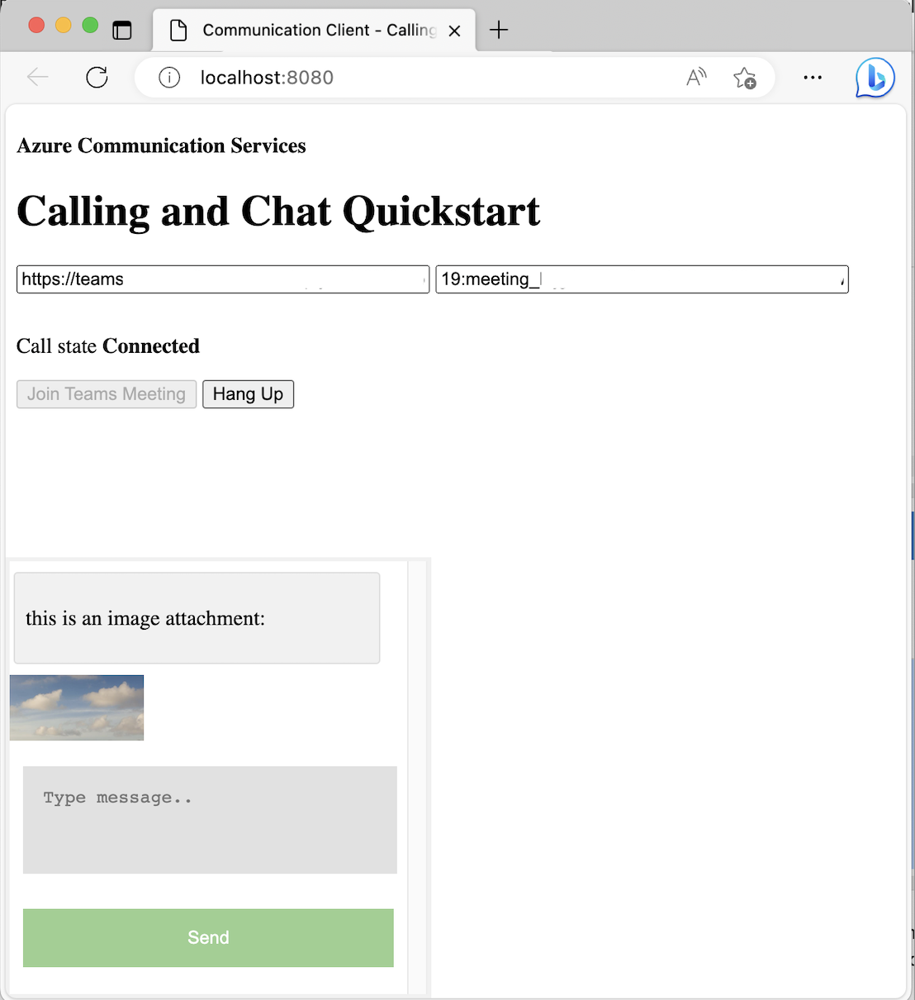

# Teams Interop Chat App with File Attachment Support

This code sample is explained as part of [this tutorial](https://docs.microsoft.com/azure/communication-services/tutorials/chat-interop/meeting-interop-features-file-attachment). Please make sure you have gone through it first.

## Prerequisites
- An active Communication Services resource. [Create a Communication Services resource](https://docs.microsoft.com/azure/communication-services/quickstarts/create-communication-resource).
- A [Teams deployment](https://docs.microsoft.com/deployoffice/teams-install)

## Code Structure

- **./index.html:** to configure a basic layout that will allow the user to join a teams meeting.
- **./client.js:** contain the application logic.

## Setup

1. Clone this sample
3. Run `npm install`
4. Grab the connection string from your communication resource and replace it at line #36 in client.js ```const connectionString = "<SECRET_CONNECTION_STRING>";```.
6. Similarly, replace the endpoint URL at line #37 in client.js ```const endpointUrl = "<ENDPOINT_URL>";```.

## Run the code

1. run `npm start`
2. open your browser and navigate to http://localhost:8080/.


## File Attachments


## Image Attachments


