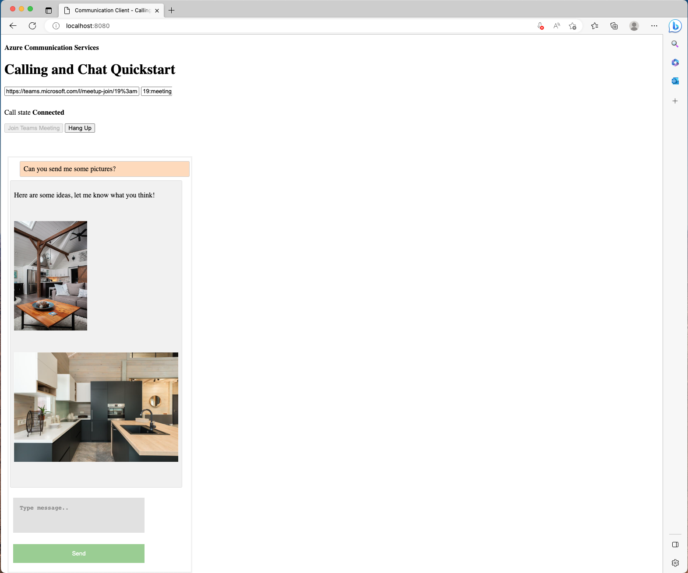
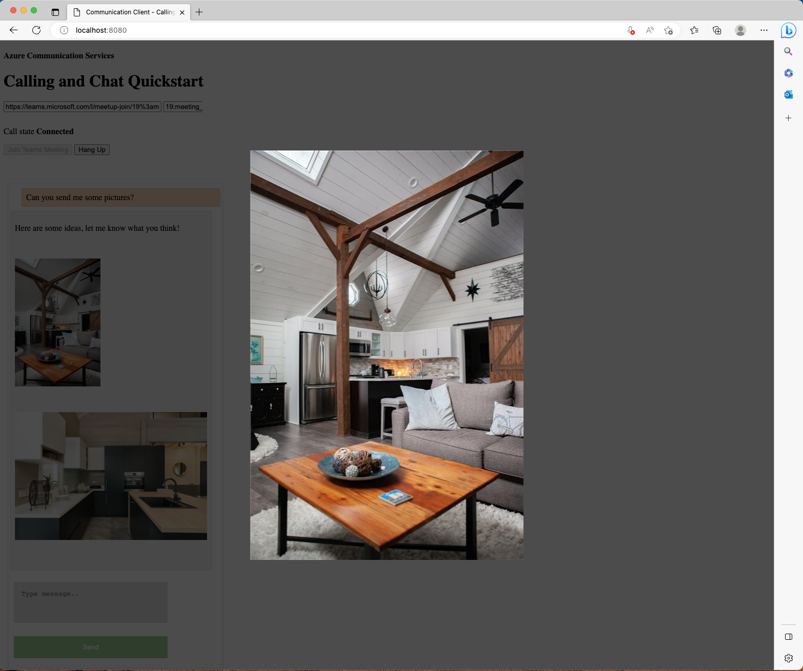

# Join your chat app to a Teams meeting

This code sample demonstrates how you can support Teams inline image interoperability with the Azure Chat SDK for JavaScript  

This sample includes the code that is explained as part of [this tutorial](https://docs.microsoft.com/azure/communication-services/tutorials/chat-interop/meeting-interop-features-inline-image), which includes a step by step explanation on how to enable inline image support.

*Note: Some GIF images fetched from `previewUrl` might not be animated, and a static preview image may be returned instead. Developers are expected to use the `url` if the intention is to fetch animated images only.*

## Prerequisites

- An active Communication Services resource. [Create a Communication Services resource](https://docs.microsoft.com/azure/communication-services/quickstarts/create-communication-resource).
- A Working [Communication Services chat web app](https://docs.microsoft.com/azure/communication-services/quickstarts/chat/get-started?pivots=programming-language-javascript).
- A Teams meeting link that was set up by a Teams business account.
- A clear understanding from previous QuickStart - [Join your chat app to a Teams meeting](https://learn.microsoft.com/en-us/azure/communication-services/quickstarts/chat/meeting-interop?pivots=platform-web).
- Chat SDK for JavaScript ([@azure/communication-chat](https://www.npmjs.com/package/@azure/communication-chat))

## Code Structure

- **./index.html:** contains a basic layout that will allow the user to join a teams meeting.
- **./client.js:** contain the application logic.

## Before running sample code

1. Open an instance of PowerShell, Windows Terminal, Command Prompt or equivalent and navigate to the directory that you'd like to clone the sample to.
2. `git clone https://github.com/Azure-Samples/communication-services-javascript-quickstarts.git`
3. In the same directory as this README, run `npm install`.

4. With the Communication Services procured in pre-requisites, fetch connection string and update at line# 27 in client.js ```const connectionString = "<SECRET_CONNECTION_STRING>";```.

## Run the code

Run:
`npm start`

You should see the following:



