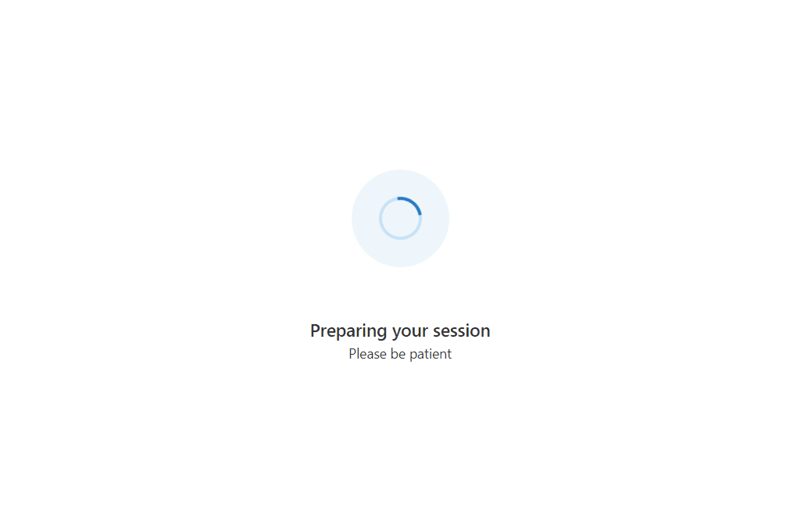

# UI Library Sample - Creating a Call Readiness Experience

This is a complete sample showcasing integration of call readiness into an [Azure Communication Services][docs-root] powered [React] application.

You can view the accompanying tutorial for this sample code [here](https://learn.microsoft.com/en-us/azure/communication-services/tutorials/call-readiness/call-readiness-overview).

This sample includes a React based application showcasing several Call Readiness components provided by the [Azure Communication Services UI library][docs-ui-library]. It has three primary stages:

1. Check the user is on a supported platform/browser
2. Prompt the user to provide camera and microphone access
3. Allow the user to choose their camera, microphone and speaker setup

[docs-root]: https://docs.microsoft.com/en-us/azure/communication-services/
[docs-ui-library]: https://azure.github.io/communication-ui-library/
[React]: https://reactjs.org/

## Sample Preview

## Code organization

* `index.tsx` - The entry point of the React App
* `App.tsx` - The functional starting point of your App. This houses the logic of switching between pages.
* `pages/` - The different pages displayed throughout stages of the App.
* `components/` - Individual components used in the pages.
* `helpers/` - Helper functions that grab data rendered in the pages and components.

## Prerequisites

* [Node.js](https://nodejs.org/en/) must be installed (16.x.x is recommended).

## Run the code

1. Run `npm i` on the directory of the project to install dependencies
1. Run `npm start`

Open your browser to <http://localhost:3000>.
