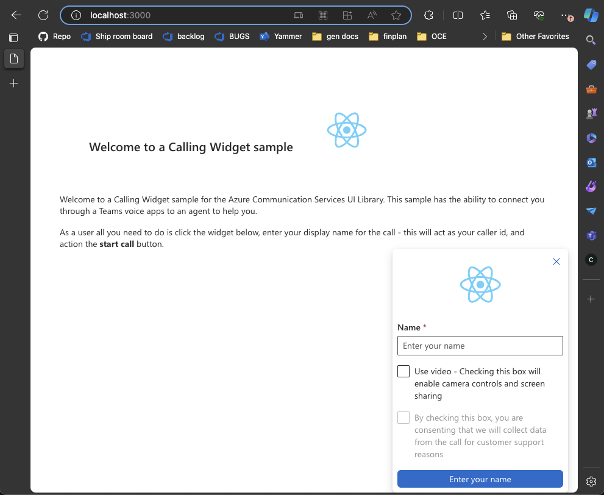
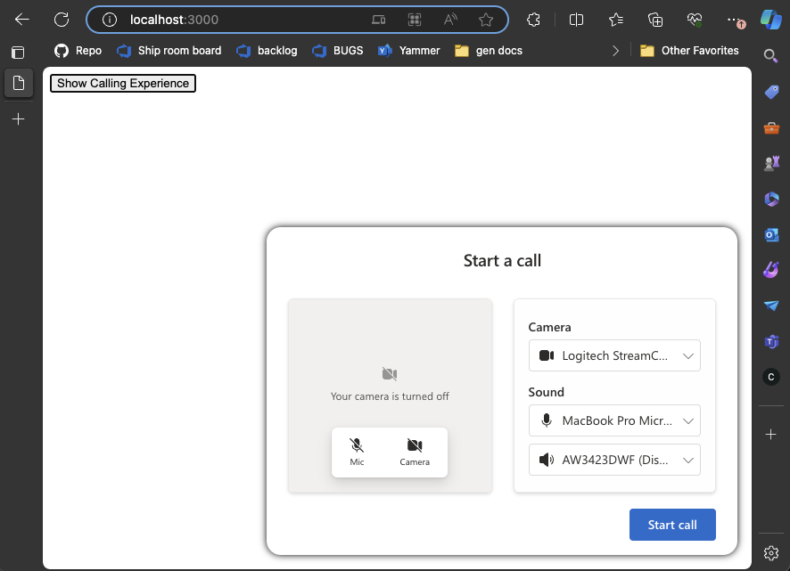

# Welcome to an Azure Communication Services Calling Widget Sample

This project is aimed to teach developers on how to create a Calling Widget using the Azure Communication UI Library.

Depending on your needs, you might need to create an experience for your customers to be able to get a hold of you with minimal setup on their part.
Calling Widget is a tool that is meant for allowing instant interaction, whether that is reaching out to customer support, having a quick call with your financial advisor, or other customer facing teams. The goal of this sample is to help make you one click away from your customers.

If you want to just try it out follow the instructions below. If you are interested in information on how to build it into your application and how this sample is constructed please checkout our [tutorial here](https://learn.microsoft.com/en-us/azure/communication-services/tutorials/calling-widget/calling-widget-overview).

### Pick your platform

In this sample we have 2 different setups for you to try out.

- [React application quickstart](#the-react-application) - You should use this if you are more comfortable with Node and React
- [JS bundle quickstart (beta)](#cross-platform-javascript-bundle-beta) - This is the setup you should run if you're more into frameworks other than React with a very simple setup

The pre-requisites need to be met for both setups in the next section.

## Pre-requisites to running the application

To run and edit the code in this project, you'll require a code editor and terminal. We recommend using [VSCode](https://code.visualstudio.com/Download) for optimal functionality.
 
In order to use this application as intended, you **need** to complete the following tutorials. Contact your Teams admin if you do not have access to Teams Admin Center.

- [Join a Teams call queue from a calling application](https://learn.microsoft.com/en-us/azure/communication-services/quickstarts/voice-video-calling/get-started-teams-call-queue)
- [Join a Teams auto attendant from a calling application](https://learn.microsoft.com/en-us/azure/communication-services/quickstarts/voice-video-calling/get-started-teams-auto-attendant)

You also need to have a [Azure Communication Services Resource](https://learn.microsoft.com/en-us/azure/communication-services/quickstarts/create-communication-resource?branch=pr-en-us-275623&tabs=windows&pivots=platform-azp) to mint [ID's and Tokens](https://learn.microsoft.com/en-us/azure/communication-services/quickstarts/identity/access-tokens?tabs=windows&pivots=platform-azportal) for your local user.

[Download the repository](https://github.com/Azure-Samples/communication-services-javascript-quickstarts/archive/refs/heads/main.zip) and extract the zip file. Alternatively, you can get the repo through the github CLI.

```bash
git clone https://github.com/Azure-Samples/communication-services-javascript-quickstarts.git
```

Finally, you will need to make sure you have [NodeJS](https://nodejs.org/en/download/) installed on your machine. You can check if you have it with the following command, the latest LTS is recommended.

```bash
node -v
```

This project is found in the `ui-library-click-to-call` directory.

## The React application



To setup the completed `React` project, In the `ui-library-click-to-call` directory, run:

### `npm install`

### Swap placeholders for identifiers

After the install is done go to the `src` folder and find the `App.tsx` file.
There are input values for the [ACS token, userId](https://learn.microsoft.com/en-us/azure/communication-services/quickstarts/identity/access-tokens?tabs=windows&pivots=platform-azportal) and your [Resource Account's](https://learn.microsoft.com/en-us/azure/communication-services/quickstarts/voice-video-calling/get-started-teams-auto-attendant?branch=pr-en-us-275623#find-object-id-for-auto-attendant) `teamsAppIdentifier` object ID.

`./src/App.tsx`

```typescript
/**
 * Token for local user.
 */
const token = "<Enter your ACS Token here>";

/**
 * User identifier for local user.
 */
const userId: CommunicationIdentifier = {
  communicationUserId: "Enter your ACS Id here",
};

/**
 * Enter your Teams voice app identifier from the Teams admin center here
 */
const teamsAppIdentifier: MicrosoftTeamsAppIdentifier = {
  teamsAppId: "<Enter your Teams Voice app id here>",
  cloud: "public",
};
```

### Run the application

In the project directory, run:

### `npm start`

Runs the app in the development mode.\
Open [http://localhost:3000](http://localhost:3000) to view it in the browser.

The page will reload if you make edits.\
You will also see any lint errors in the console.

### `npm run build`

Builds the app for production to the `build` folder.\
It correctly bundles React in production mode and optimizes the build for the best performance.

The build is minified and the filenames include the hashes.\
Your app is ready to be deployed!

See the section about [deployment](https://facebook.github.io/create-react-app/docs/deployment) for more information.

## Cross platform JavaScript bundle (Beta)

<a name="cross-platform"></a>
This project also includes a bundle that can be used to run the `React` based `CallComposite`, pre-configured for use as a click
to call experience. This bundle and a sample `index.html` file can be found in the `cross-platform-js` folder and can be used by other frameworks by importing it through a script tag.

```html
<script src="./outboundCallComposite.js"></script>
```

### Setting up the bundle

In the `index.html` file find the `userId`, `token`, and `displayName` values and enter your information like is used in the [React app](#swap-placeholders-for-identifiers).

`./cross-platform-js/index.html`

```javascript
const userId = { communicationUserId: "<Enter your local user ACS ID here>" };
const token = "<Enter your local user ACS Token here>";
const displayName = "<Enter your DisplayName here>";
```

Then set your `teamsAppId` in the `targetCallees` property of the `loadCallComposite` function

`./cross-platform-js/index.html`

```javascript
const callAdapter = await outboundCallComposite.loadCallComposite(
  {
    userId: userId,
    token: token,
    displayName: displayName,
    targetCallees: [
      {
        teamsAppId: "<Enter your Teams voice application ID here>",
        cloud: "public",
      },
    ], // Provide the identifier you want to call, can be flat as a string.
  },
  document.getElementById("outbound-call-composite-container")
);
```

### Running the bundle

There is no need to install any packages, using [npm](https://nodejs.org/en/learn/getting-started/an-introduction-to-the-npm-package-manager) from the root of the `ui-library-click-to-call` folder run 

```bash
npm run start:js
```
 after in the browser go to [http://localhost:3000](http://localhost:3000) you will then be greeted with a simplified example of click to call with the `CallComposite` configuration page as the start point after the `show calling experience` button is actioned.


