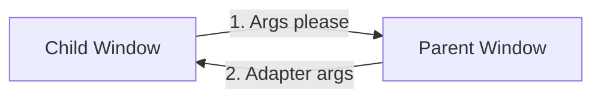

# Welcome to an Azure Communication Services Click to Call Sample


This project is aimed to teach developers on how to create a Click to Call experience using the Azure Communication UI Library.

Depending on your needs, you might need to create an experience for your customers to be able to get a hold of you with minimal setup on their part.
Click to call is a concept that is meant for allowing instant interaction, whether that is reaching out to customer support, having a quick call with your financial advisor, or other customer facing teams. The goal of this tutorial is to help you make you one click away from your customers.

If you want to just try it out follow the instructions below. If you are interested in information on how to build it into your application and how this sample is constructed continue to the tutorial section below.

## Try It Out

To just run the completed code, In the project directory, run:

### `npm install`

### Run the application

In the project directory, run:

### `npm start`

Runs the app in the development mode.\
Open [http://localhost:3000](http://localhost:3000) to view it in the browser.

The page will reload if you make edits.\
You will also see any lint errors in the console.

### `npm test`

Launches the test runner in the interactive watch mode.\
See the section about [running tests](https://facebook.github.io/create-react-app/docs/running-tests) for more information.

### `npm run build`

Builds the app for production to the `build` folder.\
It correctly bundles React in production mode and optimizes the build for the best performance.

The build is minified and the filenames include the hashes.\
Your app is ready to be deployed!

See the section about [deployment](https://facebook.github.io/create-react-app/docs/deployment) for more information.

### `npm run eject`

**Note: this is a one-way operation. Once you `eject`, you can’t go back!**

If you aren’t satisfied with the build tool and configuration choices, you can `eject` at any time. This command will remove the single build dependency from your project.

Instead, it will copy all the configuration files and the transitive dependencies (webpack, Babel, ESLint, etc) right into your project so you have full control over them. All of the commands except `eject` will still work, but they will point to the copied scripts so you can tweak them. At this point you’re on your own.

You don’t have to ever use `eject`. The curated feature set is suitable for small and middle deployments, and you shouldn’t feel obligated to use this feature. However we understand that this tool wouldn’t be useful if you couldn’t customize it when you are ready for it.

## Tutorial

Following this tutorial will:

- Allow you to control your customers audio and video experience depending on your customer scenario
- Move your customers call into a new window so they can continue browsing while on the call


This tutorial will be broken down into 3 parts:

- Creating your widget
- using post messaging to start a calling experience in a new window
- Embed your calling experience


### Setup the project

If you are not creating a new application you can skip this step.

To setup the react App, we will use the create-react-app template. This `create-react-app` command
creates an easy to run TypeScript application powered by React. This command will also install the
Azure Communication Services packages that we need to run the sample as well.

```bash
# Create an Azure Communication Services App powered by React.
npx create-react-app ui-library-click-to-call-app --template communication-react

# Change to the directory of the newly created App.
cd ui-library-click-to-call-app
```

Then you will need to update the dependency array in the `package.json` to include some beta and alpha packages for this to work:
```json
"@azure/communication-calling": "1.13.2-beta.1",
"@azure/communication-chat": "1.3.2-beta.2",
"@azure/communication-react": "1.5.1-alpha-202305300013",
"@azure/communication-calling-effects": "1.0.1",
"@fluentui/react-icons": "~2.0.203",
```

Once you have run these commands, you will be in your new project ready to get started. For this tutorial, we will be modifying the files in the
`src` directory.

### Initial App Setup

To get us started we will replace the provided `App.tsx` content with a main page that will:

- Store all of the Azure Communication information that we need to create a CallAdapter to power our Calling experience
- Control the different pages of our application
- Register the different fluent icons we use in the UI library as well as some new ones for our purposes

`src/App.tsx`

```typescript
// imports needed
import { CallAdapterLocator } from '@azure/communication-react';
import './App.css';
import { useEffect, useMemo, useState } from 'react';
import { CommunicationIdentifier, CommunicationUserIdentifier } from '@azure/communication-common';
import { Spinner, Stack, initializeIcons, registerIcons } from '@fluentui/react';
import { CallAdd20Regular, Dismiss20Regular } from '@fluentui/react-icons';
```

```typescript
type AppPages = "click-to-call" | "same-origin-call";

registerIcons({
  icons: { dismiss: <Dismiss20Regular />, callAdd: <CallAdd20Regular /> },
});
initializeIcons();
function App() {
  const [page, setPage] = useState<AppPages>("click-to-call");

  /**
   * Token for local user.
   */
  const token = "<Enter your Azure Communication Services token here>";

  /**
   * User identifier for local user.
   */
  const userId: CommunicationIdentifier = {
    communicationUserId: "<Enter your user Id>",
  };

  /**
   * This decides where the call will be going. This supports many different calling modalities in the Call Composite.
   *
   * - teams meeting locator: {meetingLike: 'url to join link for a meeting'}
   * - Azure communications group call: {groupId: 'GUID that defines the call'}
   * - Azure Communications Rooms call: {roomId: 'guid that represents a rooms call'}
   * - teams adhoc, Azure communications 1:n, PSTN calls all take a participants locator: {participantIds: ['Array of participant id's to call']}
   *
   * You can call teams voice apps like a Call queue with the participants locator.
   */
  const locator: CallAdapterLocator = {
    participantIds: ["<Enter Participant Id's here>"],
  };

  /**
   * Phone number needed from your Azure Communications resource to start a PSTN call. Can be created under the phone numbers
   * tab of your resource.
   *
   * For more information on phone numbers and Azure Communications go to this link: https://learn.microsoft.com/en-us/azure/communication-services/concepts/telephony/plan-solution
   *
   * This can be left alone if not making a PSTN call.
   */
  const alternateCallerId = "<Enter your alternate CallerId here>";

  switch (page) {
    case "click-to-call": {
      return (
        <Stack verticalAlign='center' style={{ height: "100%", width: "100%" }}>
          <Spinner
            label={"Getting user credentials from server"}
            ariaLive="assertive"
            labelPosition="top"
          />
        </Stack>
      );
    }
    case "same-origin-call": {
      return (
        <Stack verticalAlign='center' style={{ height: "100%", width: "100%" }}>
          <Spinner
            label={"Getting user credentials from server"}
            ariaLive="assertive"
            labelPosition="top"
          />
          ;
        </Stack>
      );
    }
    default: {
      return <>Something went wrong!</>
    }
  }
}

export default App;
```
In this snippet we register two new icons `<Dismiss20Regular/>` and `<CallAdd20Regular>` these new icons will be used inside the widget component that we will be creating later.

### Running the App

We can then test to see that this is working by running:

```bash
# Install the newe dependencies
npm install

# run the React app
npm run start
```

Once the app is running you can see it on `http://localhost:3000` in your browser. You should see a little spinner saying: `getting credentials from server` as
a test message.

## Part 1 Creating Your Widget

To get started, we are going to make a new component. This component is the widget that you will use to start your calling experience.

We will be using our own widget setup for this tutorial but you can expand the functionality to do more here. For us we will have the widget perform the following actions:
- Display a custom logo, this can be replaced with another image or branding of your choosing. Feel free to download the image from the code if you would like to use our image.
- Let the user decide if they want to have video in the call.
- Have the user consent to the call possible being recorded.

First, we are going to make a new directory `src/components` and in this directory we are going to make a new file called `ClickToCallComponent.tsx`. For the
purpose of this tutorial we will give this component the following properties:

`ClickToCallComponent.tsx`

First, we will set up the widget component with some imports:

`ClickToCallComponent.tsx`
```typescript
// imports needed
import { IconButton, PrimaryButton, Stack, TextField, useTheme, Checkbox, Icon } from '@fluentui/react';
import React, { useEffect, useState } from 'react';
```

Now we will introduce a interface contianing the props that the component will use.

`ClickToCallComponent.tsx`
```typescript
export interface clickToCallComponentProps {
  /**
   * if provided, will be used to create a new window for call experience. if not provided
   * will use the current window.
   */
  onRenderStartCall: () => void;
  /**
   * Custom render function for displaying logo.
   * @returns
   */
  onRenderLogo?: () => JSX.Element;
  /**
   * Handler to set displayName for the user in the call.
   * @param displayName
   * @returns
   */
  onSetDisplayName?: (displayName: string | undefined) => void;
  /**
   * Handler to set whether to use video in the call.
   */
  onSetUseVideo?: (useVideo: boolean) => void;
}
```

Each of these callbacks will control different behaviors for the calling experience.

- `onRenderStartCall` - This callback will used to trigger any handlers in your app to do things like create a new window for your calling experience.
- `onRenderLogo` - This will be used as a rendering callback to have a custom logo or image render inside the widget when getting user information.
- `onSetDisplayName` - We will use this callback to set the `displayName` of the participant when they are calling your support center.
- `onSetUseVideo` - Finally, this callback will be used to control for our tutorial whether the user will have camera and screen sharing controls (more on that later).

Finally, we will add the body of the component.

`src/views/ClickToCallComponent.tsx`
```typescript
/**
 * Widget for Click to Call
 * @param props
 */
export const ClickToCallComponent = (
  props: clickToCallComponentProps
): JSX.Element => {
  const { onRenderStartCall, onRenderLogo, onSetDisplayName, onSetUseVideo } =
    props;

  const [widgetState, setWidgetState] = useState<"new" | "setup">();
  const [displayName, setDisplayName] = useState<string>();
  const [consentToData, setConsentToData] = useState<boolean>(false);

  const theme = useTheme();

  useEffect(() => {
    if (widgetState === "new" && onSetUseVideo) {
      onSetUseVideo(false);
    }
  }, [widgetState, onSetUseVideo]);

  /** widget template for when open, put any fields here for user information desired */
  if (widgetState === "setup" && onSetDisplayName && onSetUseVideo) {
    return (
      <Stack
        styles={clicktoCallSetupContainerStyles(theme)}
        tokens={{ childrenGap: "1rem" }}
      >
        <IconButton
          styles={collapseButtonStyles}
          iconProps={{ iconName: "Dismiss" }}
          onClick={() => setWidgetState("new")}
        />
        <Stack tokens={{ childrenGap: "1rem" }} styles={logoContainerStyles}>
          <Stack style={{ transform: "scale(1.8)" }}>
            {onRenderLogo && onRenderLogo()}
          </Stack>
        </Stack>
        <TextField
          label={"Name"}
          required={true}
          placeholder={"Enter your name"}
          onChange={(_, newValue) => {
            setDisplayName(newValue);
          }}
        />
        <Checkbox
          styles={checkboxStyles(theme)}
          label={
            "Use video - Checking this box will enable camera controls and screen sharing"
          }
          onChange={(_, checked?: boolean | undefined) => {
            onSetUseVideo(!!checked);
          }}
        ></Checkbox>
        <Checkbox
          required={true}
          styles={checkboxStyles(theme)}
          label={
            "By checking this box you are consenting that we will collect data from the call for customer support reasons"
          }
          onChange={(_, checked?: boolean | undefined) => {
            setConsentToData(!!checked);
          }}
        ></Checkbox>
        <PrimaryButton
          styles={startCallButtonStyles(theme)}
          onClick={() => {
            if (displayName && consentToData) {
              onSetDisplayName(displayName);
              onRenderStartCall();
            }
          }}
        >
          StartCall
        </PrimaryButton>
      </Stack>
    );
  }

  /** default waiting state for the widget */
  return (
    <Stack
      horizontalAlign="center"
      verticalAlign="center"
      styles={clickToCallContainerStyles(theme)}
      onClick={() => {
        setWidgetState("setup");
      }}
    >
      <Stack
        horizontalAlign="center"
        verticalAlign="center"
        style={{
          height: "4rem",
          width: "4rem",
          borderRadius: "50%",
          background: theme.palette.themePrimary,
        }}
      >
        <Icon iconName="callAdd" styles={callIconStyles(theme)} />
      </Stack>
    </Stack>
  );
};
```

### Time For Some Styles

Once you have your component you will need some styles to give it some looks. For this we will create a new folder `src/styles` here we will create a new file called `ClickToCallComponent.styles.ts` and we will add the following styles.

`src/styles/ClickToCallComponent.styles.ts`

```typescript
// needed imports
import { IButtonStyles, ICheckboxStyles, IIconStyles, IStackStyles, Theme } from '@fluentui/react';
```

Now lets add the component's styles.

`ClickToCallComponent.styles.ts`
```typescript
export const checkboxStyles = (theme: Theme): ICheckboxStyles => {
  return {
    label: {
      color: theme.palette.neutralPrimary,
    },
  };
};

export const clickToCallContainerStyles = (theme: Theme): IStackStyles => {
  return {
    root: {
      width: "5rem",
      height: "5rem",
      padding: "0.5rem",
      boxShadow: theme.effects.elevation16,
      borderRadius: "50%",
      bottom: "1rem",
      right: "1rem",
      position: "absolute",
      overflow: "hidden",
      cursor: "pointer",
      ":hover": {
        boxShadow: theme.effects.elevation64,
      },
    },
  };
};

export const clicktoCallSetupContainerStyles = (theme: Theme): IStackStyles => {
  return {
    root: {
      width: "18rem",
      minHeight: "20rem",
      maxHeight: "25rem",
      padding: "0.5rem",
      boxShadow: theme.effects.elevation16,
      borderRadius: theme.effects.roundedCorner6,
      bottom: 0,
      right: "1rem",
      position: "absolute",
      overflow: "hidden",
      cursor: "pointer",
    },
  };
};

export const callIconStyles = (theme: Theme): IIconStyles => {
  return {
    root: {
      paddingTop: "0.2rem",
      color: theme.palette.white,
      transform: "scale(1.6)",
    },
  };
};

export const startCallButtonStyles = (theme: Theme): IButtonStyles => {
  return {
    root: {
      background: theme.palette.themePrimary,
      borderRadius: theme.effects.roundedCorner6,
      borderColor: theme.palette.themePrimary,
    },
    textContainer: {
      color: theme.palette.white,
    },
  };
};

export const logoContainerStyles: IStackStyles = {
  root: {
    margin: "auto",
    padding: "0.2rem",
    height: "5rem",
    width: "10rem",
    zIndex: 0,
  },
};

export const collapseButtonStyles: IButtonStyles = {
  root: {
    position: "absolute",
    top: "0.2rem",
    right: "0.2rem",
    zIndex: 1,
  },
};
```

These styles should be added to the widget as seen in the snippet above. If you added the code above as is these styles will just need importing into the `ClickToCallComponent.tsx` file.

`ClickToCallComponent.tsx`
```typescript

// add to other imports
import {
    clicktoCallSetupContainerStyles,
    checkboxStyles,
    startCallButtonStyles,
    clickToCallContainerStyles,
    callIconStyles,
    logoContainerStyles,
    collapseButtonStyles
} from '../styles/ClickToCallComponent.styles';

```

### Adding The Widget To The App

Now we will create a new folder `src/views` and add a new file for one of our pages `ClickToCallScreen.tsx`. This screen will act as our home page for the app where the user can start a new call.

We will want to add the following props to the page:

`ClickToCallScreen.tsx`

```typescript
export interface ClickToCallPageProps {
  token: string;
  userId:
    | CommunicationUserIdentifier
    | MicrosoftTeamsUserIdentifier;
  callLocator: CallAdapterLocator;
  alternateCallerId?: string;
}
```

These properties will be fed by the values that we set in `App.tsx`. We will use these props to make post messages to the app when we want to start a call in a new window (More on this later).

Next lets add the page content:

`ClickToCallScreen.tsx`
```typescript
// imports needed
import { CommunicationUserIdentifier, MicrosoftTeamsUserIdentifier } from '@azure/communication-common';
import { Stack, Text } from '@fluentui/react';
import React, { useCallback, useEffect, useMemo, useState } from 'react';
import { ClickToCallComponent } from '../components/ClickToCallComponent';
import { CallAdapterLocator } from '@azure/communication-react';
import hero from '../hero.svg';
```
```typescript
export const ClickToCallScreen = (props: ClickToCallPageProps): JSX.Element => {
  const { token, userId, callLocator, alternateCallerId } = props;

  const [userDisplayName, setUserDisplayName] = useState<string>();
  const [useVideo, setUseVideo] = useState<boolean>(false);
  // we also want to make this memoized version of the args for the new window.
  const adapterParams = useMemo(() => {
    const args = {
      userId: userId as CommunicationUserIdentifier,
      displayName: userDisplayName ?? "",
      token,
      locator: callLocator,
      alternateCallerId,
    };
    return args;
  }, [userId, userDisplayName, token, callLocator, alternateCallerId]);

  return (
    <Stack
      style={{ height: "100%", width: "100%", padding: "3rem" }}
      tokens={{ childrenGap: "1.5rem" }}
    >
      <Stack style={{ margin: "auto" }}>
        <Stack
          style={{ padding: "3rem" }}
          horizontal
          tokens={{ childrenGap: "2rem" }}
        >
          <Text style={{ marginTop: "auto" }} variant="xLarge">
            Welcome to a Click to Call sample
          </Text>
          
        </Stack>

        <Text>
          Welcome to a Click to Call sample for the Azure Communications UI
          Library. Sample has the ability to:
        </Text>
        <ul>
          <li>
            Adhoc call teams users with a tenant set that allows for external
            calls
          </li>
          <li>Joining Teams interop meetings as a Azure Communications user</li>
          <li>Make a click to call PSTN call to a help phone line</li>
          <li>Join a Azure Communications group call</li>
        </ul>
        <Text>
          As a user all you need to do is click the widget below, enter your
          display name for the call - this will act as your caller id, and
          action the <b>start call</b> button.
        </Text>
      </Stack>
      <Stack
        horizontal
        tokens={{ childrenGap: "1.5rem" }}
        style={{ overflow: "hidden", margin: "auto" }}
      >
        <ClickToCallComponent
        onRenderStartCall={() => {}}
          onRenderLogo={() => {
            return (
              
            );
          }}
          onSetDisplayName={setUserDisplayName}
          onSetUseVideo={setUseVideo}
        />
      </Stack>
    </Stack>
  );
};
```
This page has some general information on it for what our calling experiences can currently do. We can also see that it is adding the widget component that we created earlier.

Once we have this we will need to add the new view to the root of the app `App.tsx` by updating our existing `'click-to-call'` case:

`App.tsx`
```typescript
// add this with the other imports

import { ClickToCallScreen } from './views/ClickToCallScreen';

```

```typescript
    
    case 'click-to-call': {
        if (!token || !userId || !locator) {
        return (
        <Stack verticalAlign='center' style={{height: '100%', width: '100%'}}>
            <Spinner label={'Getting user credentials from server'} ariaLive="assertive" labelPosition="top" />;
        </Stack>
        )
    }
    return <ClickToCallScreen token={token} userId={userId} callLocator={locator} alternateCallerId={alternateCallerId}/>;
}
    
```

Then if you have done this and set the arguments we defined in `App.tsx` you should see this when the app is running with `npm run start`:


Then when you action the widget button you should see:


Yay! We have made the control surface for the widget! Next we will talk about what we need to add to make this widget start a call in a new window.

## Part 2 Creating a New Window Experience

Now that we have a running application with our widget on the home page, we will talk about starting the calling experience for your users with a new window. This scenario allows you to give your customer the ability to browse while still seeing your call in a new window. This can be useful in situations similar to when your users will use video and screensharing.

To start we will create a new view in the `src/views` folder called `NewWindowCallScreen.tsx`. This new screen will be used by the `App.tsx` file to go into a new call with the arguments provided to it using our `CallComposite`. The `CallComposite` can be swapped with a stateful client and UI component experience if desired as well, but that will not be covered in this tutorial. See our [storybook documentation](https://azure.github.io/communication-ui-library/?path=/docs/quickstarts-statefulcallclient--page) for more information about the stateful client.

`src/views/NewWindowCallScreen.tsx`
```typescript
// imports needed
import { CommunicationUserIdentifier, AzureCommunicationTokenCredential } from '@azure/communication-common';
import {
    CallAdapter,
    CallAdapterLocator,
    CallComposite,
    useAzureCommunicationCallAdapter
} from '@azure/communication-react';
import { Spinner, Stack } from '@fluentui/react';
import React, { useMemo } from 'react';
```
```typescript
export const SameOriginCallScreen = (props: {
  adapterArgs: {
    userId: CommunicationUserIdentifier;
    displayName: string;
    token: string;
    locator: CallAdapterLocator;
    alternateCallerId?: string;
  };
  useVideo: boolean;
}): JSX.Element => {
  const { adapterArgs, useVideo } = props;

  const credential = useMemo(() => {
    try {
      return new AzureCommunicationTokenCredential(adapterArgs.token);
    } catch {
      console.error("Failed to construct token credential");
      return undefined;
    }
  }, [adapterArgs.token]);

  const args = useMemo(() => {
    return {
      userId: adapterArgs.userId,
      displayName: adapterArgs.displayName,
      credential,
      token: adapterArgs.token,
      locator: adapterArgs.locator,
      alternateCallerId: adapterArgs.alternateCallerId,
    };
  }, [
    adapterArgs.userId,
    adapterArgs.displayName,
    credential,
    adapterArgs.token,
    adapterArgs.locator,
    adapterArgs.alternateCallerId,
  ]);

  console.log(args);

  const afterCreate = (adapter: CallAdapter): Promise<CallAdapter> => {
    adapter.on("callEnded", () => {
      adapter.dispose();
      window.close();
    });
    adapter.joinCall(true);
    return new Promise((resolve, reject) => resolve(adapter));
  };

  const adapter = useAzureCommunicationCallAdapter(args, afterCreate);

  if (!adapter) {
    return (
      <Stack
        verticalAlign="center"
        styles={{ root: { height: "100vh", width: "100vw" } }}
      >
        <Spinner
          label={"Creating adapter"}
          ariaLive="assertive"
          labelPosition="top"
        />
      </Stack>
    );
  }
  return (
    <Stack styles={{ root: { height: "100vh", width: "100vw" } }}>
      <CallComposite
        options={{
          callControls: {
            cameraButton: useVideo,
            screenShareButton: useVideo,
            moreButton: false,
            peopleButton: false,
            displayType: "compact",
          },
          localVideoTileOptions: {
            position: !useVideo ? "hidden" : "floating",
          },
        }}
        adapter={adapter}
      />
    </Stack>
  );
};
```

For our `CallComposite`, we have some configuration to do for Click to Call. Depending on your use case, we have a number of customizations that can change the user experience. This sample chooses to hide the local video tile, camera, and screen sharing controls if the user opts out of video for their call. We also in addition to these configurations on the `CallComposite` use the `afterCreate` function defined in the snippet we auto join the call. This will bypass the configuration screen and drop the user into the call with their mic live, as well will auto close the window when the call ends. Just remove the call to `adapter.join(true);` from the `afterCreate` function and the configuration screen will show as normal. Next we will talk about how to get this screen the information once we have our `CallComposite` configured.

To do this, we will create some handlers to send post messages between the parent window and child window to signal that we want some information. See diagram:


This flow illustrates that if the child window has spawned it needs to ask for the arguments. This has to do with React and that if the parent window just sends a message right after creation the call adapter arguments needed are lost when the application mounts. This is because in the new window the listener is not set yet until after a render pass completes. More on where these event handlers are made to come.

Now we will want to update the splash screen we created earlier. First we will add a reference to the new child window that we will create.

`ClickToCallScreen.tsx`

```typescript
    
    const [userDisplayName, setUserDisplayName] = useState<string>();
    const newWindowRef = useRef<Window | null>(null);
    const [useVideo, setUseVideo] = useState<boolean>(false);
    
```

Next we will create a handler that we pass to our widget that will create a new window that will start the process of sending the post messages.

`ClickToCallScreen.tsx`
```typescript
    
    const startNewWindow = useCallback(() => {
        const startNewSessionString = 'newSession=true';
        newWindowRef.current = window.open(
            window.origin + `/?${startNewSessionString}`,
            'call screen',
            'width=500, height=450'
        );
    }, []);
    
```

This handler starts a new window position and place a new query arg in the window URL so that the main application knows that it is time to start a new call.

Next we will add a `useEffect` hook that is creating a event handler listening for new post messages from the child window.

`ClickToCallScreen.tsx`
```typescript
    
    useEffect(() => {
        window.addEventListener('message', (event) => {
            if (event.origin !== window.origin) {
                return;
            }
            if (event.data === 'args please') {
                const data = {
                    userId: adapterParams.userId,
                    displayName: adapterParams.displayName,
                    token: adapterParams.token,
                    locator: adapterParams.locator,
                    alternateCallerId: adapterParams.alternateCallerId,
                    useVideo: useVideo
                };
                console.log(data);
                newWindowRef.current?.postMessage(data, window.origin);
            }
        });
    }, [adapterParams, adapterParams.locator, adapterParams.displayName, useVideo]);
    
```

This handler will listen for events from the child window. (**NOTE: make sure that if the origin of the message is not from your app then return**) If the child window asks for arguments, we will send it the arguments needed to construct a `AzureCommunicationsCallAdapter`.

Finally on this screen we will add the `startNewWindow` handler to the widget so that it knows to create the new window.

`ClickToCallScreen.tsx`
```typescript
    
    <Stack horizontal tokens={{ childrenGap: '1.5rem' }} style={{ overflow: 'hidden', margin: 'auto' }}>
        <ClickToCallComponent
            onRenderStartCall={startNewWindow}
            onRenderLogo={() => {
                return (
                    
                );
            }}
            onSetDisplayName={setUserDisplayName}
            onSetUseVideo={setUseVideo}
        />
    </Stack>
    
```

Next we will need to update the `App.tsx` file to listen for and ask for the messages from what would be the parent window. First to start, you might recall that we added a new query parameter to the URL of the application `newSession=true`. To use this and have our app look for that in the URL we will need to create a utility function to parse out that parameter so our application will behave differently when it is received.

To do that lets add a new folder `src/utils` and in this folder we will add the file `AppUtils.ts`. In this file we will put the following function:

`AppUtils.ts`
```typescript
/**
 * get go ahead to request for adapter args from url
 * @returns
 */
export const getStartSessionFromURL = (): boolean | undefined => {
  const urlParams = new URLSearchParams(window.location.search);
  return urlParams.get("newSession") === "true";
};
```

This function will take a look into our applications URL and see if the param we are looking for is there. You can also stick some other parameters in there

As well we will want to add a new type in here to track the different pieces needed to create a `AzureCommunicationCallAdapter`. This type can also be simplified if you are using our calling stateful client, this approach will not be covered in this tutorial though.

`AppUtils.ts`
```typescript
/**
 * Properties needed to create a call screen for a Azure Communications CallComposite.
 */
export type AdapterArgs = {
  token: string;
  userId: CommunicationIdentifier;
  locator: CallAdapterLocator;
  displayName?: string;
  alternateCallerId?: string;
};
```

Once we have added these two things we can go back to the `App.tsx` file to make some more updates.

First thing we will want to do is update `App.tsx` to use that new utility function that we created above, we will want to use a `useMemo` hook for this so that it is fetched exactly once and not at every render. That is done like so:

`App.tsx`
```typescript
// you will need to add these imports

import { AdapterArgs, getStartSessionFromURL } from './utils/AppUtils';

```

```typescript

  const startSession = useMemo(() => {
    return getStartSessionFromURL();
  }, []);

```

Following this we will want to add some state to make sure that we are tracking the new args for the adapter. We will pass these to the `SameOriginCallScreen.tsx` that we made earlier so it can construct an adapter. As well state to track whether the user wants to use video controls or not.

`App.tsx`
```typescript
/**
   * Properties needed to start an Azure Communications Call Adapter. When these are set the app will go to the Call screen for the
   * Click to Call scenario. Call screen should create the credential that will be used in the call for the user.
   */
  const [adapterArgs, setAdapterArgs] = useState<AdapterArgs | undefined>();
  const [useVideo, setUseVideo] = useState<boolean>(false);
```

Then, after we have added that we will want to add a event listener like we did earlier to the `ClickToCallScreen.tsx` to the `App.tsx` listening for post messages. Like before we will put it in a `useEffect` hook, this time though we will leave the dependency array empty so that we only add this listener one time on the initial render.

`App.tsx`
```typescript

  useEffect(() => {
    window.addEventListener('message', (event) => {
      if (event.origin !== window.location.origin) {
        return;
      }

      if ((event.data as AdapterArgs).userId && (event.data as AdapterArgs).displayName !== '') {
        console.log(event.data);
        setAdapterArgs({
          userId: (event.data as AdapterArgs).userId as CommunicationUserIdentifier,
          displayName: (event.data as AdapterArgs).displayName,
          token: (event.data as AdapterArgs).token,
          locator: (event.data as AdapterArgs).locator,
          alternateCallerId: (event.data as AdapterArgs).alternateCallerId
        });
        setUseVideo(!!event.data.useVideo);
      }
    });
  }, []);

```
Next we will want to add two more `useEffect` hooks to `App.tsx` these two hooks will
- Ask the parent window of the application for arguments for the `AzureCommunicationCallAdapter`, we will use the `window.opener` reference provided since this hook will be checking to see if it is the child window.
- Checks to see if we have the arguments appropriately set from the event listener above to start a call and change the app page to be the call screen.

`App.tsx`
```typescript

  useEffect(() => {
    if (startSession) {
      console.log('asking for args');
      if (window.opener) {
        window.opener.postMessage('args please', window.opener.origin);
      }
    }
  }, [startSession]);

  useEffect(() => {
    if (adapterArgs) {
      console.log('starting session');
      setPage('same-origin-call');
    }
  }, [adapterArgs]);

```
Finally once we have done that we will want to add the new screen that we made earlier to the template as well. We will also want to make sure that we do not show the Click to call screen if the `startSession` parameter is found, this will avoid a flash for the user.

`App.tsx`
```typescript
// add with other imports

import { SameOriginCallScreen } from './views/NewWindowCallScreen';

```

```typescript

  switch (page) {
    case 'click-to-call': {
      if (!token || !userId || !locator || startSession !== false) {
        return (
          <Stack verticalAlign='center' style={{height: '100%', width: '100%'}}>
            <Spinner label={'Getting user credentials from server'} ariaLive="assertive" labelPosition="top" />;
          </Stack>
        )
        
      }
      return <ClickToCallScreen token={token} userId={userId} callLocator={locator} alternateCallerId={alternateCallerId}/>;
    }
    case 'same-origin-call': {
      if (!adapterArgs) {
        return (
          <Stack verticalAlign='center' style={{ height: '100%', width: '100%' }}>
            <Spinner label={'Getting user credentials from server'} ariaLive="assertive" labelPosition="top" />;
          </Stack>
        )
      }
      return (
        <SameOriginCallScreen
          adapterArgs={{
            userId: adapterArgs.userId as CommunicationUserIdentifier,
            displayName: adapterArgs.displayName ?? '',
            token: adapterArgs.token,
            locator: adapterArgs.locator,
            alternateCallerId: adapterArgs.alternateCallerId
          }}
          useVideo={useVideo}
        />
      );
    }
  }

```
Now when the application runs in a new window, it will see that it is supposed to start a call so it will:
- Ask for the different Adapter arguments from the parent window
- Make sure that the adapter arguments are set appropriately and start a call

Now when you pass in the arguments, set your `displayName`, and click `Start Call` you should see the following:


In this case we see a PSTN call being started with no video. 

With this new window experience your users will be able to:
- continue using other tabs in their browser or other applications and still be able to see your call
- resize the window to fit their viewing needs such as increasing the size to better see a screen share

This concludes the tutorial for click to call with a new window experience. Below will be a optional step to embed the calling surface into the widget itself keeping your users on their current page.
## Part 3 (Optional) Embedding Your Calling Experience

Finally in this optional section of the tutorial we will talk about making a embedded version of the Calling surface. We will continue from where we left off in the last section and make some modifications to our existing screens. 

To start lets take a look at the props for the `ClickToCallComponent.tsx` props, these will need to be updated to have the widget hold the Calling surface. We will make two changes.
- Add a new prop for the adapter arguments needed for the `AzureCommunicationCallAdapter` we will call this `adapterArgs`.
- Make `onRenderStartCall` optional, this will allow us to come back to using a new window easier in the future.

`ClickToCallComponent.tsx`

```typescript
export interface ClickToCallComponentProps {
    /**
     *  arguments for creating an AzureCommunicationCallAdapter for your Calling experience
     */
    adapterArgs: AdapterArgs;
    /**
     * if provided, will be used to create a new window for call experience. if not provided
     * will use the current window.
     */
    onRenderStartCall?: () => void;
    /**
     * Custom render function for displaying logo.
     * @returns
     */
    onRenderLogo?: () => JSX.Element;
    /**
     * Handler to set displayName for the user in the call.
     * @param displayName
     * @returns
     */
    onSetDisplayName?: (displayName: string | undefined) => void;
    /**
     * Handler to set whether to use video in the call.
     */
    onSetUseVideo?: (useVideo: boolean) => void;
}
```

Now we will need to introduce some logic to use these arguments to make sure that we are starting a call appropriately. This will include adding state to create an `AzureCommunicationCallAdapter` inside the widget itself so it will look a lot like the logic in `NewWindowCallScreen.tsx` adding the adapter to the widget will look something like this:

`ClickToCallComponent.tsx`
```typescript
// add this to the other imports

import { CommunicationUserIdentifier, AzureCommunicationTokenCredential } from '@azure/communication-common';
import {
    CallAdapter,
    CallAdapterLocator,
    CallComposite,
    useAzureCommunicationCallAdapter,
    AzureCommunicationCallAdapterArgs
} from '@azure/communication-react';
import { AdapterArgs } from '../utils/AppUtils';
// lets update our react imports as well
import React, { useCallback, useEffect, useMemo, useState } from 'react';

```
```typescript

    const credential = useMemo(() => {
        try {
            return new AzureCommunicationTokenCredential(adapterArgs.token);
        } catch {
            console.error('Failed to construct token credential');
            return undefined;
        }
    }, [adapterArgs.token]);

    const callAdapterArgs = useMemo(() => {
        return {
            userId:adapterArgs.userId,
            credential:  credential,
            locator: adapterArgs.locator,
            displayName: displayName,
            alternateCallerId: adapterArgs.alternateCallerId
        }
    },[adapterArgs.locator, adapterArgs.userId, credential, displayName])

    const adapter = useAzureCommunicationCallAdapter(callAdapterArgs as AzureCommunicationCallAdapterArgs);

```

Lets also add a `afterCreate` function like before to do a few things with our adapter once it is constructed. Since we are now interacting with state in the widget we will want to use a react `useCallback` just to make sure we are not defining this function every time we do a render pass. In our case our function will reset the widget to the `'new'` state when the call ends and clear the user's `displayName` so they can start a new session. You can however return it to the `'setup'` state with the old displayName so that can easily call again as well.

`ClickToCallComponent.tsx`
```typescript

    const afterCreate = useCallback(async (adapter: CallAdapter): Promise<CallAdapter> => {
        adapter.on('callEnded',() => {
            setDisplayName(undefined);
            setWidgetState('new');
            adapter.dispose();
        });
        return adapter;
    },[])

    const adapter = useAzureCommunicationCallAdapter(callAdapterArgs as AzureCommunicationCallAdapterArgs, afterCreate);

```

Once we again have an adapter we will need to update the template to account for a new widget state, so on that note we will also need to add to the different modes that the widget itself can hold. We will add a new `'inCall'` state like so:

`ClickToCallComponent.tsx`
```typescript

const [widgetState, setWidgetState] = useState<'new' | 'setup' | 'inCall'>('new');

```

Then we will need to add a new logic to our Start Call button in the widget that will check to see which mode it will start the call, new window or embedded. That logic is as follows:

`ClickToCallComponent.tsx`
```typescript

    <PrimaryButton
        styles={startCallButtonStyles(theme)}
        onClick={() => {
            if (displayName && consentToData && onRenderStartCall) {
                onSetDisplayName(displayName);
                onRenderStartCall();
            } else if (displayName && consentToData && adapter) {
                setWidgetState('inCall');
                adapter?.joinCall();
            }
        }}
    >
        StartCall
    </PrimaryButton>

```

We will also want to introduce some interal state to the widget about the local user's video controls.

`ClickToCallComponent.tsx`
```typescript
const [useLocalVideo, setUseLocalVideo] = useState<boolean>(false);
```

Then lets go back to our style sheet for the wdiget. We will need to add new styles to allow the `CallComposite` to grow to its minimum size.

`ClickToCallComponent.styles.ts`
```typescript
export const clickToCallInCallContainerStyles = (theme: Theme): IStackStyles => {
  return {
    root: {
      width: '35rem',
      height: '25rem',
      padding: '0.5rem',
      boxShadow: theme.effects.elevation16,
      borderRadius: theme.effects.roundedCorner6,
      bottom: 0,
      right: '1rem',
      position: 'absolute',
      overflow: 'hidden',
      cursor: 'pointer',
      background: theme.semanticColors.bodyBackground
    }
  }
}
```

Finally in the widget we will need to add a section to the template that is when the widget is in the `'inCall'` state that we added earlier. So now we should have our template looking as follows:

`ClickToCallComponent.tsx`
```typescript
if (widgetState === 'setup' && onSetDisplayName && onSetUseVideo) {
        return (
            <Stack styles={clicktoCallSetupContainerStyles(theme)} tokens={{ childrenGap: '1rem' }}>
                <IconButton
                    styles={collapseButtonStyles}
                    iconProps={{ iconName: 'Dismiss' }}
                    onClick={() => setWidgetState('new')}
                />
                <Stack tokens={{ childrenGap: '1rem' }} styles={logoContainerStyles}>
                    <Stack style={{ transform: 'scale(1.8)' }}>{onRenderLogo && onRenderLogo()}</Stack>
                </Stack>
                <TextField
                    label={'Name'}
                    required={true}
                    placeholder={'Enter your name'}
                    onChange={(_, newValue) => {
                        setDisplayName(newValue);
                    }}
                />
                <Checkbox
                    styles={checkboxStyles(theme)}
                    label={'Use video - Checking this box will enable camera controls and screen sharing'}
                    onChange={(_, checked?: boolean | undefined) => {
                        onSetUseVideo(!!checked);
                        setUseLocalVideo(true);
                    }}
                ></Checkbox>
                <Checkbox
                    required={true}
                    styles={checkboxStyles(theme)}
                    label={
                        'By checking this box you are consenting that we will collect data from the call for customer support reasons'
                    }
                    onChange={(_, checked?: boolean | undefined) => {
                        setConsentToData(!!checked);
                    }}
                ></Checkbox>
                <PrimaryButton
                    styles={startCallButtonStyles(theme)}
                    onClick={() => {
                        if (displayName && consentToData && onRenderStartCall) {
                            onSetDisplayName(displayName);
                            onRenderStartCall();
                        } else if (displayName && consentToData && adapter) {
                            setWidgetState('inCall');
                            adapter?.joinCall();
                        }
                    }}
                >
                    StartCall
                </PrimaryButton>
            </Stack>
        );
    }

    if(widgetState === 'inCall' && adapter){
        return(
            <Stack styles={clickToCallInCallContainerStyles(theme)}>
                <CallComposite adapter={adapter} options={{
                    callControls: {
                        cameraButton: useLocalVideo,
                        screenShareButton: useLocalVideo,
                        moreButton: false,
                        peopleButton: false,
                        displayType: 'compact'
                    },
                    localVideoTileOptions: { position: !useLocalVideo ? 'hidden' : 'floating' }
                }}></CallComposite>
            </Stack>
        )
    }

    return (
        <Stack
            horizontalAlign="center"
            verticalAlign="center"
            styles={clickToCallContainerStyles(theme)}
            onClick={() => {
                setWidgetState('setup');
            }}
        >
            <Stack
                horizontalAlign="center"
                verticalAlign="center"
                style={{ height: '4rem', width: '4rem', borderRadius: '50%', background: theme.palette.themePrimary }}
            >
                <Icon iconName="callAdd" styles={callIconStyles(theme)} />
            </Stack>
        </Stack>
    );
```
Now that we have updated our widget to be more versitile we will want to take another look at the `ClickToCallScreen.tsx` to make some adjustments to how we are calling the widget. We will to turn on the new embedded experience do two things:
- Remove the start call handler that we provided earlier
- provide the adapter arguments to the widget that we would normally be emitting through our post messages.

That looks like this:

`ClickToCallScreen.tsx`
```typescript

    <Stack horizontal tokens={{ childrenGap: '1.5rem' }} style={{ overflow: 'hidden', margin: 'auto' }}>
        <ClickToCallComponent
            adapterArgs={adapterParams}
            onRenderLogo={() => {
                return (
                    
                );
            }}
            onSetDisplayName={setUserDisplayName}
            onSetUseVideo={setUseVideo}
        />
    </Stack>

```
Now that we have made these changes we can start our app again if it is shut down with `npm run start`. If we go through the start call process like we did before we should see the following when starting the call: 


Like before this is a call starting with the video controls enabled. 

Thanks for following the different tutorials here. This concludes the quickstart for Click-to-Call in the Azure Communications UI Library.
