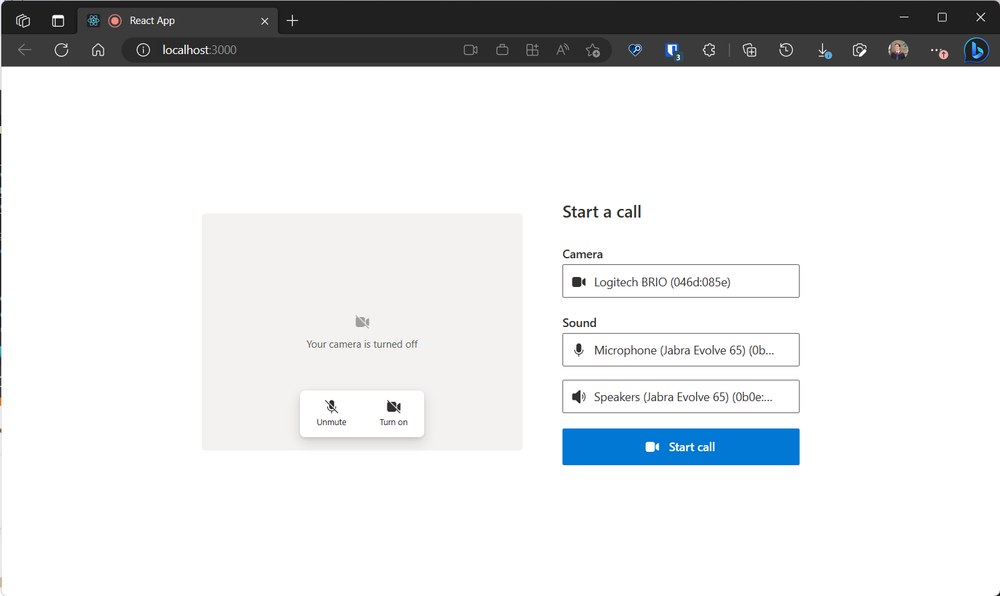

# Get Started with Composites - PSTN Calling & 1:N Calling

This sample showcases how Call Composites can be used for making outbound calls to phone numbers and other azure communication users.

## Prerequisites

- An Azure account with an active subscription. [Create an account for free](https://azure.microsoft.com/free/?WT.mc_id=A261C142F) .
- [Node.js](https://nodejs.org/en/) Active LTS and Maintenance LTS versions.
- An active Communication Services resource. [Create a Communication Services resource](https://docs.microsoft.com/azure/communication-services/quickstarts/create-communication-resource). You will need the endpoint value for the resource
- An identity with VoIP. Generate an identity using the [Azure Portal](https://docs.microsoft.com/azure/communication-services/quickstarts/identity/quick-create-identity).
- A phone number procured through Azure Communication Service portal using [Azure Portal](https://docs.microsoft.com/en-us/azure/communication-services/quickstarts/telephony/get-phone-number).

## Run the code

1. Run `npm i` on the directory of the project to install dependencies
2. Swap placeholders for identifiers in the code.
   - Go to the `src` folder and find the `INPUTS.tsx` file.
   - Replace the values for the the `userIdentity` and `userToken` for the identity you created in Azure Portal in the `Prerequisites` step.
   - Replace the `participantIds` with the identity or phone number of the user(s) you want to call.
     - If you are calling a phone number, replace the `callerId` value as well.
   - Update the display name to a name of your choice.
   - Save the file.
3. Run `npm run start`

Open your browser to <http://localhost:3000>. You should see the following:

Finally, click `Start Call` to start the call.
