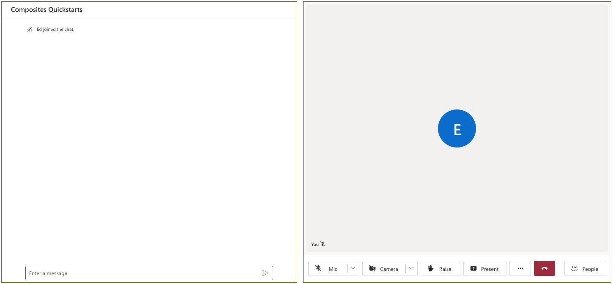
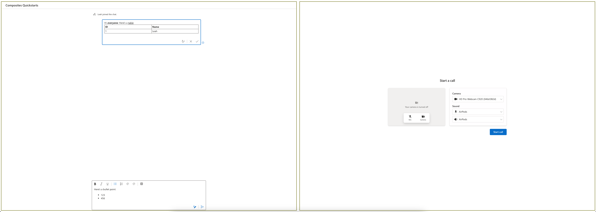

# Overview

This sample demonstrates how the rich text editor and its dependencies can be excluded from the bundle if they're not required, utilizing tree-shaking techniques such as the sideEffects option in webpack. Please see `webpack.config.js` as an example of how to use sideEffects.

## Prerequisites

- An Azure account with an active subscription. [Create an account for free](https://azure.microsoft.com/free/?WT.mc_id=A261C142F) .
- [Node.js](https://nodejs.org/en/) Active LTS and Maintenance LTS versions (8.11.1 and 10.14.1 recommended).
- An active Communication Services resource. [Create a Communication Services resource](https://docs.microsoft.com/azure/communication-services/quickstarts/create-communication-resource). You will need the endpoint value for the resource
- An identity with both VoIP and Chat scopes. Generate an identity using the [Azure Portal](https://docs.microsoft.com/azure/communication-services/quickstarts/identity/quick-create-identity).

## Run the code

1. Run `npm i` on the directory of the project to install dependencies
2. Swap placeholders for identifiers in the code.
   - Go to the `src` folder and find the `app.tsx` file.
   - There input values for the `Endpoint_URL` for your resource and the `USER_ID` and `TOKEN` for the identity you created.
   - Optional: You can update the display name to match a string value of your choice.
   - Save the file.
3. Run `npm run start`

Open your browser to ` http://localhost:8080`. You should see the following:

Feel free to style the composites to your desired size and layout inside of your application.

## Enable Rich Text Editor

By default, the chat composite is using the plain text editor for the SendBox component and the MessageThread component's edit function.
We also provide a Rich Text Editor for rich text formatting, table inserting etc.
To try it out: - Go to the `src` folder and find the `app.tsx` file. - Change the value for `richTextEditorEnabled` to true.
Note that inserting inline images is not enabled for this Quickstart.
Please use the [ui-library-quickstart-teams-interop-meeting-chat](https://github.com/Azure-Samples/communication-services-javascript-quickstarts/tree/main/ui-library-quickstart-teams-interop-meeting-chat) Quickstart to try out the inline image inserting function.

Open your browser to ` http://localhost:3000`. You should see the following with the Rich Text Editor enabled:

## Data Collection

The software may collect information about you and your use of the software and send it to Microsoft. Microsoft may use this information to provide services and improve our products and services. You may turn off the telemetry as described below. You can learn more about data collection and use in the help documentation and Microsoft’s [privacy statement](https://go.microsoft.com/fwlink/?LinkID=824704). For more information on the data collected by the Azure SDK, please visit the [Telemetry Guidelines](https://azure.github.io/azure-sdk/general_azurecore.html#telemetry-policy) page.

### Telemetry Configuration

Telemetry collection is on by default when using the `useAzureCommunication...Adapter` hooks or the `createAzureCommunication...Adapter`

To opt out it is recommended developers:

- Use components directly. Learn how to [use components](https://azure.github.io/communication-ui-library/?path=/docs/components-get-started--docs)
- Create a custom custom adapter. Learn how to [create one here](https://azure.github.io/communication-ui-library/?path=/docs/composites-adapters--docs#createazurecommunicationchatadapterfromclient)

This will disable telemetry for all methods going to ACS.