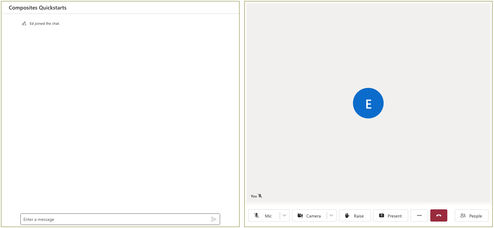

# Get Started with Composites

For full instructions on how to build this code sample from scratch, look at [Quickstart: Get Started with Composites](https://azure.github.io/communication-ui-library/?path=/story/quickstarts-composites--page)

## Prerequisites

- An Azure account with an active subscription. [Create an account for free](https://azure.microsoft.com/free/?WT.mc_id=A261C142F)  .
- [Node.js](https://nodejs.org/en/) Active LTS and Maintenance LTS versions (8.11.1 and 10.14.1 recommended).
- An active Communication Services resource. [Create a Communication Services resource](https://docs.microsoft.com/azure/communication-services/quickstarts/create-communication-resource). You will need the endpoint value for the resource
- An identity with both VoIP and Chat scopes. Generate an identity using the [Azure Portal](https://docs.microsoft.com/azure/communication-services/quickstarts/identity/quick-create-identity).

## Run the code

1. Run `npm i` on the directory of the project to install dependencies
2. Swap placeholders for identifiers in the code.
    - Go to the `src` folder and find the `app.tsx` file.
    - There input values for the `Endpoint_URL` for your resource and the `USER_ID` and `TOKEN` for the identity you created.
    - Optional: You can update the display name to match a string value of your choice.
    - Save the file.
4. Run `npm run start`

Open your browser to ` http://localhost:3000`. You should see the following:

Feel free to style the composites to your desired size and layout inside of your application.
