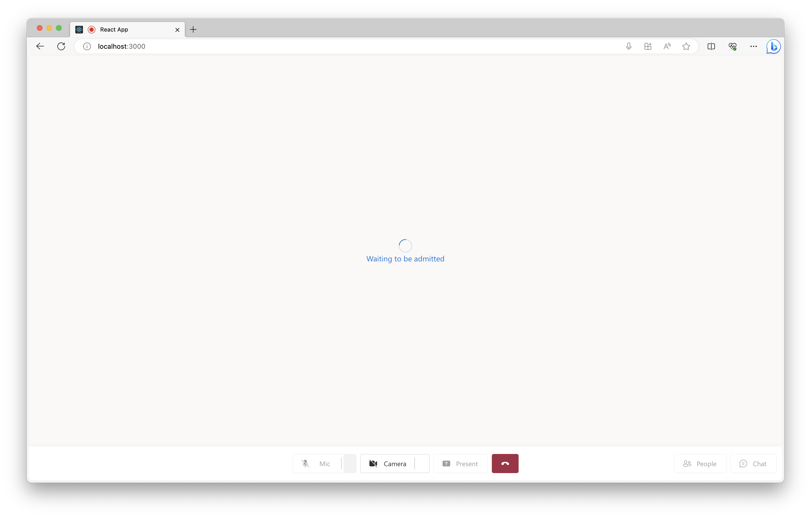
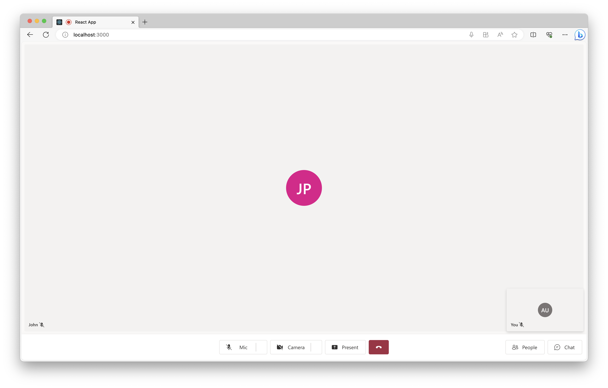
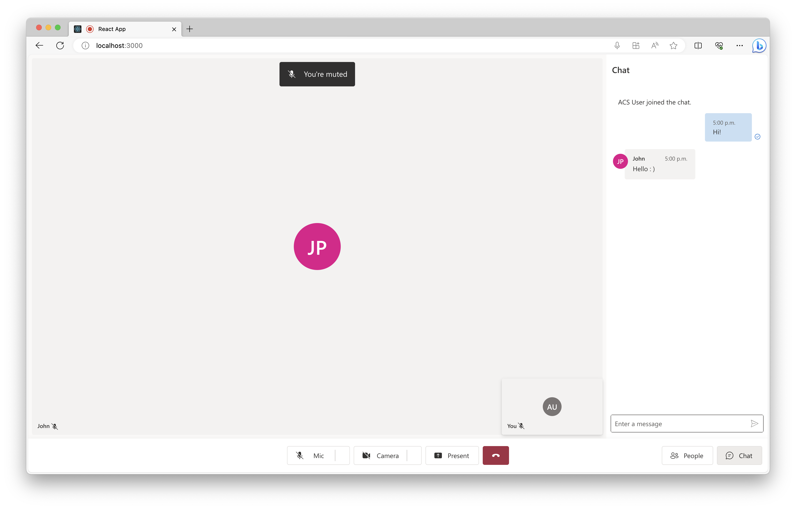
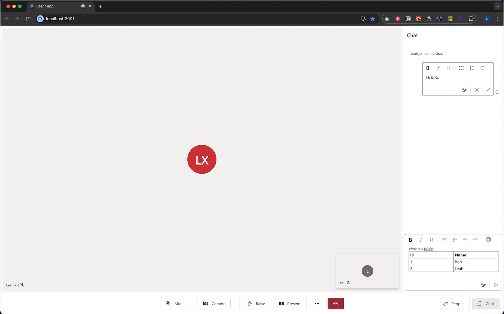

# Overview

This sample is part of tutorials for:

- [Enable file sharing with UI Library in Teams Interoperability Chat](https://docs.microsoft.com/azure/communication-services/tutorials/file-sharing-tutorial-interop-chat)
- [Enable Inline Image with UI Library in Teams Interoperability Chat](https://docs.microsoft.com/azure/communication-services/tutorials/inline-image-tutorial-interop-chat)

And this sample is built based on the [CallWithChat Compsite](https://azure.github.io/communication-ui-library/?path=/docs/composites-call-with-chat-basicexample--basic-example) from our storybook page.

## Prerequisites

- An Azure account with an active subscription. [Create an account for free](https://azure.microsoft.com/free/?WT.mc_id=A261C142F)  .
- [Node.js](https://nodejs.org/en/) Active LTS and Maintenance LTS versions.
- An active Communication Services resource. [Create a Communication Services resource](https://docs.microsoft.com/azure/communication-services/quickstarts/create-communication-resource). You will need the endpoint value for the resource
- An identity with both VoIP and Chat scopes. Generate an identity using the [Azure Portal](https://docs.microsoft.com/azure/communication-services/quickstarts/identity/quick-create-identity).
- A Teams meeting link

## Run the code

1. Run `npm i` on the directory of the project to install dependencies
2. Swap placeholders for identifiers in the code.
    - Go to the `src` folder and find the `app.tsx` file.
    - Replace the following values:
        - `ENDPOINT_URL` of your Communication Resource
        - `USER_ID` of your Communication User
        - `TEAMS_MEETING_LINK` you would be using for this sample
        - `TOKEN` of your Communication Resource
    - Save the file.
4. Run `npm run start`

Open your browser to ` http://localhost:3000`. You should see the following:

once you are admitted by a meeting participant, you would be navigated to the Composite:

then click on the chat button to reveal the chat panel:

Feel free to style the composites to your desired size and layout inside of your application.

## Enable Rich Text Editor
 By default, this Quickstart is using the plain text editor for the SendBox component and the MessageThread component's edit function.
 We also provide a Rich Text Editor for rich text formatting, table inserting etc.
 To try it out:
     - Go to the `src` folder and find the `App.tsx` file.
     - Change the value for `richTextEditorEnabled` to true.

Open your browser to `http://localhost:3000`. You should see the following with the Rich Text Editor enabled:
