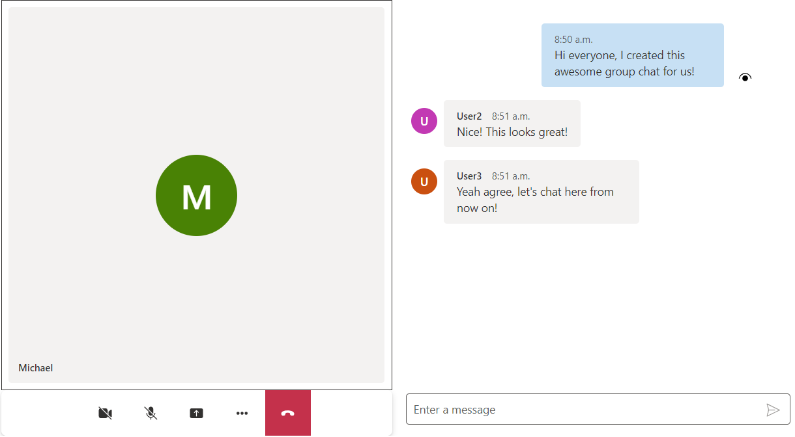

# Get Started with UI Components

For full instructions on how to build this code sample from scratch, look at [Quickstart: Get Started with UI Components](https://azure.github.io/communication-ui-library/?path=/docs/quickstarts-uicomponents--page)

## Prerequisites

- An Azure account with an active subscription. [Create an account for free](https://azure.microsoft.com/free/?WT.mc_id=A261C142F)  .
- [Node.js](https://nodejs.org/en/) Active LTS and Maintenance LTS versions (8.11.1 and 10.14.1 recommended).

## Run the code

1. Run `npm i` on the directory of the project to install dependencies
2. Run `npm run start`

Open your browser to ` http://localhost:3000`. You should see the following:

Feel free to style the components to your desired size and layout inside of your application. Check out the stateful client quickstart to learn how to connect the components to the communications data plane.

## Enable Rich Text Editor
 By default, this Quickstart is using the plain text editor for the SendBox component and the MessageThread component's edit function.
 We also provide a Rich Text Editor which provides rich text formatting, table inserting etc.
 To try it out:
     - Go to the `src` folder and find the `ChatComponents.tsx` file.
     - Change the value for `richTextEditorEnabled` to true.

Open your browser to `http://localhost:3000`. You should see the following with the Rich Text Editor enabled:

