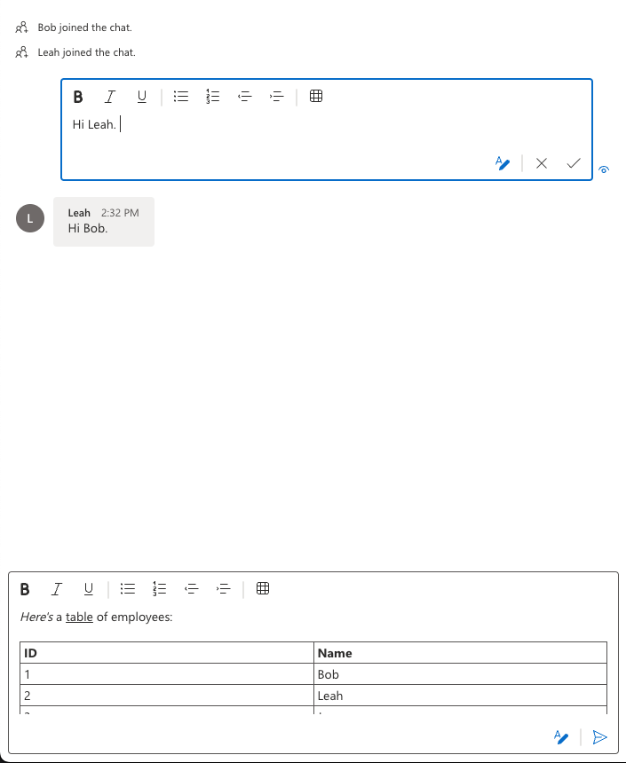

# Get Started with Stateful Chat Client

For full instructions on how to build this code sample from scratch, look at [Quickstart: Get Started with Stateful Chat Client](https://azure.github.io/communication-ui-library/?path=/docs/stateful-client-get-started-chat--docs)

## Prerequisites

- An Azure account with an active subscription. [Create an account for free](https://azure.microsoft.com/free/?WT.mc_id=A261C142F) .
- [Node.js](https://nodejs.org/en/) Active LTS and Maintenance LTS versions.
- An active Communication Services resource. [Create a Communication Services resource](https://docs.microsoft.com/azure/communication-services/quickstarts/create-communication-resource).
- An identity with both VoIP and Chat scopes. Generate an identity using the [Azure Portal](https://docs.microsoft.com/azure/communication-services/quickstarts/identity/quick-create-identity).

## Run the code

1. Run `npm i` on the directory of the project to install dependencies
2. Add required information in `src/App.tsx` file
3. Run `npm run start`

Open your browser to ` http://localhost:3000`. You should see the following:

Feel free to style the composites to your desired size and layout inside of your application.

## Enable Rich Text Editor

By default, this Quickstart is using the plain text editor for the SendBox component and the MessageThread component's edit function.
We also provide a Rich Text Editor for rich text formatting, table inserting etc.
To try it out: - Go to the `src` folder and find the `ChatComponentsStateful.tsx` file. - Change the value for `richTextEditorEnabled` to true.
Note that inserting inline images is not enabled for this Quickstart.
Please use the [ui-library-quickstart-teams-interop-meeting-chat](https://github.com/Azure-Samples/communication-services-javascript-quickstarts/tree/main/ui-library-quickstart-teams-interop-meeting-chat) Quickstart to try out the inline image inserting function.

Open your browser to `http://localhost:3000`. You should see the following with the Rich Text Editor enabled:

