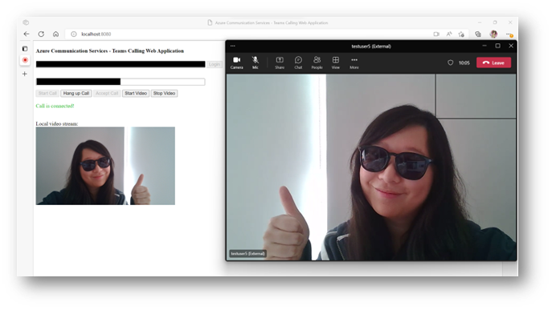
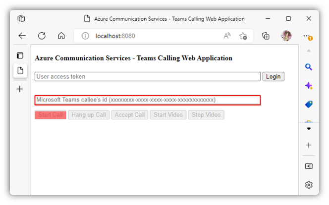

# Build your first Teams calling application

This tutorial demonstrates step-by-step instructions to build a video calling web application empowered by [Azure Communication Service](https://azure.microsoft.com/en-us/products/communication-services/#overview). This application connects you to a Microsoft Teams voice application as shown in the picture. The tutorial has a prerequisites section that prepares you for further development. After the prerequisites section, we will prepare you for web development environment; give you sample code to build and run; and teach you how to use the application.



## Table of Contents
- [Prerequisites](#prerequisites)
- [Setup development environment](#setup-development-environment)
- [Develop the code](#develop-the-code)
- [Run the code](#run-the-code)
- [Use the application](#use-the-application)
- [Ask questions](#ask-questions)


## Prerequisites
- Create [Microsoft Azure account](https://azure.microsoft.com/free/?WT.mc_id=A261C142F) with active subscription
- Install [Node.js](https://nodejs.org/en/)
- Add [Azure Communication Service resrouce](https://learn.microsoft.com/en-us/azure/communication-services/quickstarts/create-communication-resource?pivots=platform-azp&tabs=windows#create-azure-communication-services-resource) to your Azure subscription
- Create [Call Queue](https://learn.microsoft.com/en-us/microsoftteams/create-a-phone-system-call-queue?tabs=general-info)
- Obtain a application id using [Graph Explorer](https://developer.microsoft.com/en-us/graph/graph-explorer)

## Setup Development Environment
1. Open terminal and run the following command to create a folder for your calling application.

```
mkdir myTeamsCallingApp && cd myTeamsCallingApp
```


2. Install packages with the following commands.

```
npm install @azure/communication-common@next --save
npm install @azure/communication-calling@latest --save
```

3. Install webpack with the following command.

```
npm install webpack@4.42.0 webpack-cli@3.3.11 webpack-dev-server@3.10.3 --save-dev
```

## Run the code
1. Build and run your code with the following command in terminal.
```
npx webpack-dev-server --entry ./client.js --output bundle.js --debug --devtool inline-source-map
```

2. Go to http://localhost:8080/ from your browser to access the application.


## Use the application
1. Enter the User access token you acquired from **Prerequisites**, and click login


2. Enter a Teams id you acquired from “Prerequisites” as your callee, and click Start Call
 

### **Congratulations! You just set up your first Teams calling application!**


## Ask questions
You can post your questions via our [support channels](https://learn.microsoft.com/en-us/azure/communication-services/support). 
